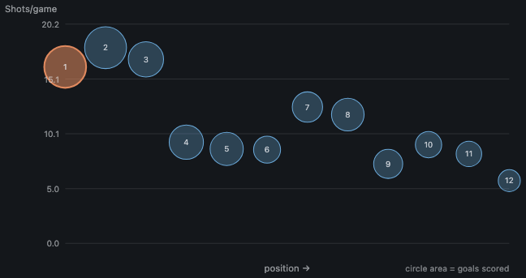

# Findings

*[日本語](FINDINGS.ja.md)*

Six things the Tokyo University Football Association's own pages do not show,
taken from its published match records: results from 2021 and player-level
records for the five seasons from 2022.

The federation publishes fixtures, a league table and a top-scorers list. The
records underneath hold per-player shot counts, lineups, timed substitutions,
coded cards and — the column this document leans on hardest — the high school or
club youth side every player arrived from. None of it is aggregated anywhere.

Everything here describes teams, divisions and year groups. Nothing describes an
individual; [the last section](#what-is-not-in-this-document) explains why that
is a deliberate limit rather than a gap.

Division names are the federation's own. `1部リーグ` is the first division and so
on down; the Challenge League has no number in its name, which turned out to
matter and is the subject of section 2.

## In one screen

Ordered by how much the number said that was not already obvious.

| | result | why it is worth reading |
|---|---|---|
| [1](#1-a-squad-list-beats-a-league-table) | Preseason forecasting | The squad list, read before a ball is kicked, predicts the season **better than last year's final table does** — +12.8% against the division average, where the table alone scores **−0.2%**. |
| [2](#2-a-club-that-changes-division-stops-being-described-by-its-own-table) | Division changes | Promotion costing points is the obvious half. The half worth reading: for a **relegated** club, last season's table predicts the next one at r = **+0.017** — nothing at all — while the squad list still works at +0.568. |
| [3](#3-two-negative-results-worth-more-than-the-positive-one) | What did not work | A second, better-designed pedigree source moved the model by **+0.2 points**, because it was measuring the same thing (r = 0.866). Rating schools on their own graduates made it **worse**. Both are kept. |
| [4](#4-year-groups-have-no-structure-beyond-fourth-years-score) | Year groups | A promising pattern in the 2026 third years **disappeared** once five seasons were laid side by side. Kept in as a negative result. |
| [5](#5-conversion-rises-as-the-division-falls-except-in-the-second) | Conversion by division | Conversion rises as the division falls, **except** that the second division fell below the first in 2025 and has not come back. No explanation survived checking, so none is offered. |
| [6](#6-the-table-and-the-shot-count-disagree-below-third-place) | Position, shots, shape | Below third place the table sorts on conversion rather than volume, and squad character separates clubs the table does not. |

## The dataset

Every league and cup competition the federation still publishes, as of August
2026.

| Season | Series | Fixtures | Appearances | Shot rows | Substitutions |
|---|---|---|---|---|---|
| 2026 | 4 | 350 | 6,633 | 8,564 | 1,720 |
| 2025 | 6 | 370 | 10,979 | 14,062 | 2,892 |
| 2024 | 6 | 426 | 12,451 | 15,795 | 3,227 |
| 2023 | 5 | 409 | 11,603 | 14,990 | 2,888 |
| 2022 | 5 | 410 | 11,396 | 13,611 | 2,915 |
| 2021 | 8 | 347 | 31 | 36 | 9 |

2,312 fixtures, 53,093 appearances, 3.56 million player-minutes, 7,748 goals,
6,499 players across 53 clubs.

## Reading the numbers

Four things change how the figures below should be read.

**Minutes are reconstructed.** The federation records a starting eleven, a bench
and timed substitutions, and never a minutes-played figure. Every per-90 number
here is derived from those three, including the correction for players sent off,
who leave the pitch at the minute of the red card and are otherwise credited with
a full match.

**Player-level recording starts in 2022.** 2021 has results and nothing else. A
handful of stray appearance rows survive the schema change — enough, if taken at
face value, to produce a conversion rate of 30.9 — so per-minute figures are
withheld for that season rather than computed from a rounding error.

**2026 was about 60% played** when this was written. It appears in the tables and
is drawn faintly in the charts, and it is excluded from the promotion and
relegation averages.

**These are not six seasons of one competition.** Tokyo ran its own four-division
league to 2021 and restructured to three in 2022; in 2023 it merged with the
Kanagawa prefectural league and was reconstituted as the Tokyo/Kanagawa division
of the Kanto league, losing six of its twelve first-division clubs upward in the
process; a third division was inserted in 2025 and the Challenge League abolished
in 2026. A first-division club that did nothing at all gained 0.83 points a game
across the 2023 boundary — five times the movement at any other. Anything below
that pools seasons is pooling different competitions, and
[docs/LEAGUE_STRUCTURE.en.md](docs/LEAGUE_STRUCTURE.en.md) is the accounting.

## 1. A squad list beats a league table

Everything else in this project measures a season that is already under way. This
measures the moment before one starts, when the only document that exists is the
registration list: every player, their academic year, and where they came from.

Two signals come out of it. **Pedigree** is how often a player's high school won
its prefecture and reached the All-Japan Championship — an external rating,
editions 97 to 104, that knows nothing whatever about this league. **Academy
share** is the proportion of the squad that came through a professional club's
youth side rather than school football.

The baseline is the only one that matters: what last season's table already told
you. Scoring is leave-one-season-out, with every season predicted by a model
fitted on the others, and all the held-out predictions pooled and scored once.

**Clubs that have a previous season (n = 141)**

| Model | RMSE | vs the division average | r |
|---|---|---|---|
| last season's table | 1.0095 | **−0.2%** | +0.070 |
| last season's table + the division change | 0.9080 | +9.9% | +0.464 |
| the squad list alone | 0.9171 | +9.0% | +0.414 |
| the squad list + academy share | 0.9115 | +9.5% | +0.427 |
| table + division change + squad list | 0.8534 | +15.3% | +0.549 |
| **all four** | **0.8496** | **+15.7%** | **+0.557** |

**Every club, previous season or not (n = 191)**

| Model | RMSE | vs the division average | r |
|---|---|---|---|
| the squad list alone | 0.8942 | +10.6% | +0.448 |
| **the squad list + academy share** | **0.8723** | **+12.8%** | **+0.489** |

Read the first row of the first table before anything else. **Last season's final
table, on its own, is worse than predicting the division average for everyone.**
It only starts working once it is also told whether the club changed division,
which is a different piece of information about a different season.

The squad list needs no such help, and it applies to fifty more club-seasons —
including every club that has just come up or has never appeared before, which is
exactly the case where a forecast is worth having.

A validity check, since a pedigree score could easily be nothing but a proxy for
which division a club is in. Every feature is standardised inside its own
division and season before it is used, so the model is never told the level. It
sorts them correctly anyway:

| Season | Level 1 | Level 2 | Level 3 | Level 4 |
|---|---|---|---|---|
| 2022 | 37.3% | 22.6% | 10.2% | – |
| 2023 | 27.4% | 14.5% | 11.3% | – |
| 2024 | 31.1% | 14.6% | 9.4% | – |
| 2025 | 31.8% | 16.8% | 12.2% | 6.8% |
| 2026 | 35.6% | 13.7% | 11.2% | – |

*Share of the squad that came from a school which reached the All-Japan
Championship. The order never breaks.*

And the concrete version. Fitting on everything except 2026, then ranking the
2026 first division from the squad lists alone, before the season started:

| Club | Preseason | Actual (60% played) | Championship schools | Academy |
|---|---|---|---|---|
| 帝京大学 | **+1.34** | +1.26 | 63% | 7% |
| 大東文化大学 | +1.19 | +0.30 | 57% | 14% |
| 武蔵大学 | +0.65 | −0.35 | 68% | 5% |
| 玉川大学 | +0.48 | −1.10 | 42% | 0% |
| 桜美林大学 | +0.23 | **+1.37** | 29% | 15% |
| 日本大学文理学部 | +0.14 | −0.67 | 38% | 2% |
| 横浜国立大学 | −0.26 | −0.24 | 16% | 3% |
| 上智大学 | −0.28 | −1.10 | 30% | 18% |
| 学習院大学 | −0.35 | +0.40 | 20% | 0% |
| 神奈川工科大学 | −0.45 | −1.64 | 13% | 3% |
| 朝鮮大学校 | −0.85 | **+0.19** | **0%** | 3% |

Both columns are standardised inside the division, so 0 is average and the unit
is the division's own standard deviation. Correlation over these eleven clubs is
+0.384. Tokyo Keizai lead the actual table and are missing from this one: they
returned to the division in 2026 and so have no previous season, which the
squad-list-only model would have handled and this one does not.

**The clearest miss is the most instructive one.** Korea University's squad holds
not one player from a school that has reached the All-Japan Championship, so the
model puts them last, and they are mid-table. Tokyo Korean High School does not
enter that competition. The measure is blind to them by construction — section 3
is what happened when that was chased.

```bash
togakuren intake --validate      # every table above
togakuren intake --year 2026     # the preseason ranking
```

## 2. A club that changes division stops being described by its own table


Promotion and relegation are the one natural experiment this dataset offers: the
same squad, one season later, against different opposition. Forty-nine completed
cases across five seasons.

| | Cases | Change in points per game | Got worse |
|---|---|---|---|
| Promoted | 32 | **−0.97** | 29 of 32 |
| Relegated | 17 | **+1.24** | 1 of 17 |

**None of which is surprising, and it is not the finding.** A club that moves up
plays better opponents and takes fewer points. The size is worth recording; the
direction is not worth anyone's attention.

What is not obvious is what the move does to *predictability*. Split every
club-season by what the club had just done, and ask how well each signal
forecasts the season about to start:

| | Clubs | Last season's table | The squad list |
|---|---|---|---|
| Promoted | 29 | +0.664 | +0.545 |
| **Relegated** | 24 | **+0.017** | **+0.568** |
| Stayed put | 88 | +0.494 | +0.325 |

**For a relegated club, its own last table carries no information at all.** Not
weak information — none, r = +0.017. The same clubs' squad lists predict them at
+0.568, which is better than the squad list manages anywhere else in the table.

The obvious objection is range restriction: relegated clubs all finished near the
bottom, so of course their previous scores barely vary. They vary about as much
as the promoted clubs' do — standard deviation 0.66 against 0.75 — and the
promoted column works fine at +0.664. Whatever kills the signal on the way down
leaves it intact on the way up.

The mechanism this suggests, which this dataset can support but not prove: going
down is a squad event and coming up is a form event. A relegated university side
loses the players who were keeping it up, so its finishing position describes a
group that has partly left. A promoted one carries much the same group into a
harder division. Either way the practical consequence is section 1's — when a
club moves, stop reading its table and read its squad list.

**This section used to claim an asymmetry, and that claim is withdrawn.** It said
promotion takes a full point per game while relegation returns only half of it,
and that three relegated sides in ten keep falling. Both halves were an artefact.
The Challenge League has no number in its name, and it was the third level from
2022 and the fourth from 2025; reading it off a fixed map filed thirteen clubs
that had moved level or upward in 2022 under "relegated". They had not improved,
and they were holding the relegation average down to +0.53. Corrected, relegation
returns slightly more than promotion costs.
[docs/LEAGUE_STRUCTURE.en.md](docs/LEAGUE_STRUCTURE.en.md) is the full accounting.

The −0.97 does survive being cut by which reorganisation it came from: −0.96
across the 2022 restructure, −0.94 across the 2023 merger with Kanagawa, −1.18
across the 2025 insertion of a third division, and −0.95 at the boundaries where
the ladder did not move at all. If the number were a by-product of the league
being rebuilt, it would not survive that split.

## 3. Two negative results worth more than the positive one

Section 1's pedigree measure has a known defect, and the two obvious fixes were
both tried and both failed. They are here because the failures say more about the
problem than the success does.

**The defect.** Reaching the All-Japan Championship means winning a prefecture,
and prefectures are not equally hard. Tokyo has roughly four hundred schools
competing for two places; the smallest prefectures have a few dozen competing for
one. A Tokyo school of a given standard is far less likely to leave a record than
an identical school elsewhere. Korea University's 0% in section 1 is the extreme
case.

**Fix one: use a league instead of a knockout.** The Takamado Cup JFA U-18 league
grades a school by the division it plays in over a whole season — Premier,
Prince, prefectural — which does not depend on winning one tournament in one
prefecture, and which puts professional academies on the same table. It should
have been strictly better. Eight seasons of Premier and Prince tables were
collected from the JFA's own pages: 42 and 284 sides.

It was not better. Added to the championship measure it moved the model from
+15.7% to +15.8%; on its own it was slightly worse, +14.3% against +15.3%.

The reason is worth more than the attempt. **The two measures correlate at r =
0.866.** They are the same information wearing different clothes, and for the
same structural reason: a Prince league is about twenty clubs per region, so it
grades 21% of the squad rows where the championship grades 21%, and **the other
79% of players have no grade under either.** The players arriving at Tokyo and
Kanagawa universities went to schools in the prefectural leagues *below* Prince.
A problem about prefectural competition had been swapped for a problem about
regional competition. Not one of the six schools that motivated the hypothesis
was rescued: Tokyo Korean High School has no grade in either system.

**Fix two: fill the silent 79% from inside the data.** Rate each school by how
much its own graduates played once they got here, and use that only where the
external measures say nothing. Cost: zero — the data is already loaded.

It made the model worse in every combination tried: +15.7% to +15.5%, and +15.8%
to +15.6%. The endogenous rating's within-division correlation with the result is
+0.152, which is nothing, and it was already being handled carefully: the target
club and the target season are both excluded from every school's rating, because
an affiliated school sends a whole year group to one university every year, so
"how much did this school's graduates play" partly encodes *which* university
they went to. Excluding both is necessary and evidently not sufficient.

**What both failures say together.** The preseason signal is close to exhausted
by one question — *is this squad full of players from nationally known schools
and academies?* — and the answer only exists for a fifth of them. A second
measure of the same fifth buys 0.2 points; an invented measure for the other four
fifths costs 0.2. The remaining honest option is a continuous one, such as how far
a school got in its prefectural qualifying rather than whether it won, and after
these two it is not a promising one.

*The Takamado tables are not shipped with this repository and the numbers in this
section cannot be reproduced from it. They are recorded because the experiment
cost real collection work, and a negative result is worth exactly the work
somebody else now does not have to repeat.*

## 4. Year groups have no structure beyond "fourth years score"


Goals per 90 minutes by academic year, first division only. Pooling divisions
mixes populations, so this stays inside one of them.

| | 2022 | 2023 | 2024 | 2025 | 2026 |
|---|---|---|---|---|---|
| 1st year | 0.086 | 0.118 | 0.044 | 0.122 | 0.118 |
| 2nd year | 0.140 | 0.120 | 0.126 | **0.074** | 0.146 |
| 3rd year | 0.128 | 0.124 | 0.161 | **0.169** | **0.117** |
| 4th year | 0.167 | 0.136 | 0.167 | 0.148 | **0.178** |

The 2026 third years score at 0.117, the lowest third-year figure in five
seasons. Read alone that looks like a story about the third year of a degree. It
is not: the 2025 third years were the *best* group on the table at 0.169, and the
dip that season belonged to the second years. Whichever year group looks weak
changes annually, which is what a cohort effect looks like and not what a
structural one looks like.

Only the fourth years are consistent, top of the table in three seasons of five
and never bottom. This is a negative result, and it is the reason a single season
is not enough to publish a claim about year groups.

One real change: first years took 9.5% of first-division minutes in 2026, against
5.5% in 2024. The highest share since 2022.

## 5. Conversion rises as the division falls, except in the second


| | 2022 | 2023 | 2024 | 2025 | 2026 |
|---|---|---|---|---|---|
| Division 1 | 0.167 | 0.147 | 0.177 | 0.165 | 0.150 |
| Division 2 | 0.173 | 0.189 | 0.182 | **0.145** | **0.142** |
| Division 3 | – | – | – | 0.198 | 0.186 |
| Challenge | 0.233 | 0.214 | 0.207 | 0.187 | – |

Weaker defences concede more of the chances they face, so the deeper divisions
finish at higher rates — the Challenge League converted at 0.233 in 2022 against
0.167 in the first division. The third division holds the pattern in both seasons
it exists here.

The second division does not. It sat above the first division for three seasons,
then crossed under it in 2025 and stayed there. The reorganisation that runs
through the middle of this table is now documented — the 2024 second division of
nineteen clubs was the staging year before a third division was created, and the
Challenge League it is being compared against changed level in 2025 and stopped
existing in 2026 ([docs/LEAGUE_STRUCTURE.en.md](docs/LEAGUE_STRUCTURE.en.md)).
Knowing that does not explain the crossing: the 2025 second division was ten
clubs, the same size it had been in most seasons. The claim is still open.

## 6. The table and the shot count disagree below third place



Rank on the x axis, shots per game on the y, total goals as circle area. Five of
twelve first-division sides in 2026 sit at least three places away from their
shot-volume rank.

| Team | Position | Shot-volume rank | Shots/game | Conversion |
|---|---|---|---|---|
| 横浜国立大学 | 7 | **4** | 12.5 | 0.110 |
| 武蔵大学 | 8 | **5** | 11.8 | 0.143 |
| 玉川大学 | 10 | **7** | 9.1 | 0.102 |
| 大東文化大学 | 5 | 8 | 8.7 | 0.204 |
| 朝鮮大学校 | 6 | 9 | 8.6 | 0.116 |

The top three do both — they shoot most and score most, so the axes agree. Below
that the table sorts on conversion, not volume. Yokohama National shoot as often
as the third-placed side and convert at half the rate; Daito Bunka shoot least in
the top half and finish at 0.204.


The same clubs on six indices, each scaled within the season: shot volume,
finishing, defence, rotation (minutes spread beyond a settled eleven), youth
(share of minutes played by first and second years) and late push (share of shots
in the second half). The vertices are numbered in that order, clockwise from the
top, and the dashed outline is the league mean — which is not 50, because each
axis is scaled inside the season, so it sits high where the field is bunched near
the top and low where one club drags a long tail.

The extremes of each axis in 2026 belong to six different clubs:

| Axis | Highest | Lowest |
|---|---|---|
| Shot volume | 桜美林大学 (2nd) | 神奈川工科大学 (12th) |
| Finishing | 学習院大学 (4th) | 神奈川工科大学 (12th) |
| Defence | 帝京大学 (3rd) | 神奈川工科大学 (12th) |
| Rotation | 大東文化大学 (5th) | 横浜国立大学 (7th) |
| Youth | 武蔵大学 (8th) | 桜美林大学 (2nd) |
| Late push | 帝京大学 (3rd) | 朝鮮大学校 (6th) |

Only the bottom club is extreme on more than two axes, and only in the obvious
direction. The rest have nothing to do with finishing position: Yokohama National
are the most settled side in the division in seventh, Daito Bunka the most
rotated in fifth, Musashi the youngest in eighth.

## What is not in this document

The most striking single number in the 2026 first division belongs to a player,
not a team: 7.34 shots per 90 minutes, roughly twice the next highest, from
someone who started six of thirteen appearances. A goals ranking cannot see them
at all.

They are not named here, and neither is anyone else.

The people in these records are amateur students. The federation publishes their
names because it runs the competition; that is not the same as a third party
republishing them. Per-player rows are personal data, and removing the name does
not fix it: of 189 first-division players above 270 minutes, 105 are unique on
team, position and appearances alone.

Section 1 makes that worse rather than better, which is worth being explicit
about. Adding the school — the column the entire preseason model is built on —
takes the same division from 105 unique rows to **184 of 189**. So the school
appears in this project only as a club-level average, never on a player's row, in
any privacy mode. [docs/DATA_POLICY.en.md](docs/DATA_POLICY.en.md) has the full
table and the reasoning, and `privacy-check` reproduces it.

Everything player-level runs locally, on a database this repository does not
ship.

## Related documents

- [docs/LEAGUE_STRUCTURE.en.md](docs/LEAGUE_STRUCTURE.en.md) — the three reorganisations inside
  this dataset, what they did to section 2, and the one claim they retracted.
- [docs/SEASON_TRENDS.en.md](docs/SEASON_TRENDS.en.md) — every table behind sections 2, 4 and 5,
  including every division change and every club's path through the tiers.
- [docs/DATA_POLICY.en.md](docs/DATA_POLICY.en.md) — what may be published, measured rather
  than assumed.
- [docs/seasons/](docs/seasons/) — one document per season and division, 2021–2026.
- [docs/PLAYER_ANALYSIS_SAMPLE.en.md](docs/PLAYER_ANALYSIS_SAMPLE.en.md) — what the player-level
  output looks like, over an invented season.

## Reproducing

```bash
pip install .
togakuren ingest                                 # about 40 seconds
togakuren intake --validate                      # section 1, and the split in section 2
togakuren intake --year 2026                     # the preseason ranking in section 1
togakuren trends                                 # sections 2, 4 and 5
togakuren dashboard --series "2026 1部"          # section 6
togakuren privacy-check --series "2026 1部"      # the last section
togakuren trends --format md --lang en           # docs/SEASON_TRENDS.en.md
togakuren profiles --all                         # docs/seasons/
```

The figures are charts from those two pages, `trends` and `dashboard --privacy
aggregate`, isolated and screenshotted. No number in this document was typed in
by hand, with the single exception marked as such in section 3.

See [docs/FIGURES.en.md](docs/FIGURES.en.md) for which chart each file is.
