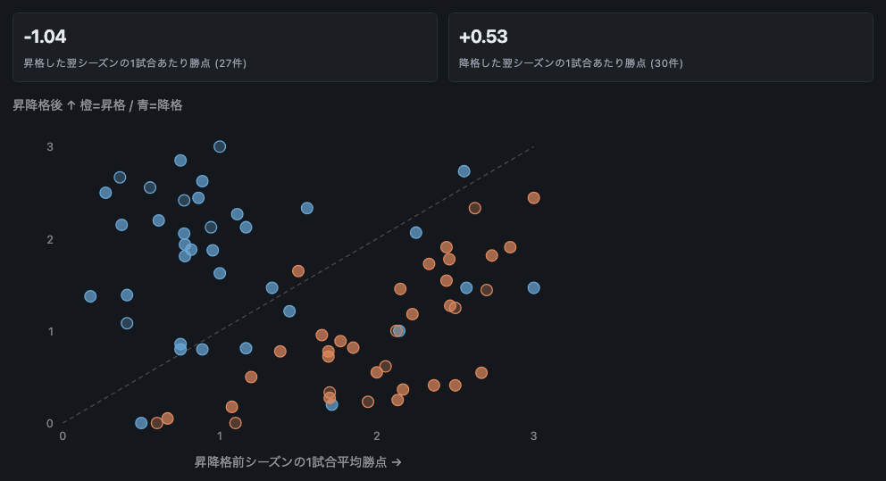
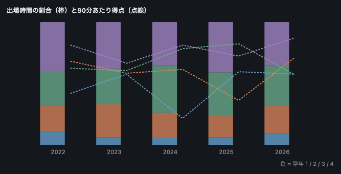
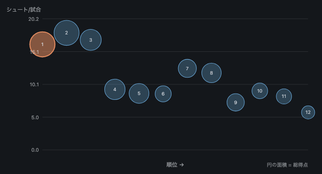
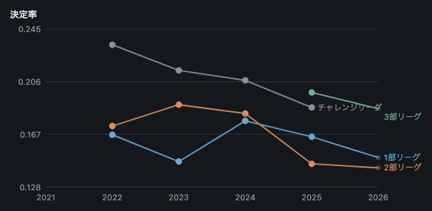
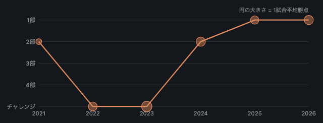

# 分析結果

*[English](FINDINGS.md)*

東京都大学サッカー連盟が公開している5シーズン分の試合記録から、連盟のサイト自体には出ていない6つのこと。

連盟が公開しているのは日程・順位表・得点ランキングです。その裏にある記録には選手ごとのシュート数、スタメン、時刻つきの交代、反則コードつきのカードが入っていますが、どこにも集計されていません。以下はすべて連盟がすでにサイトに載せている情報だけを使っていて、やったことはシーズンをまたいで読み直したことと、正しい分母で割ったことだけです。

扱っているのはチーム・部・学年です。個人については何も書いていません。それが不足ではなく意図的な制約である理由は[最後の節](#この文書に載せていないもの)に書いてあります。

## データセット

2026年8月時点で連盟が公開している全リーグ戦・カップ戦。

| 年度 | シリーズ | 試合 | 出場記録 | シュート行 | 交代 |
|---|---|---|---|---|---|
| 2026 | 4 | 350 | 6,633 | 8,564 | 1,720 |
| 2025 | 6 | 370 | 10,979 | 14,062 | 2,892 |
| 2024 | 6 | 426 | 12,451 | 15,795 | 3,227 |
| 2023 | 5 | 409 | 11,603 | 14,990 | 2,888 |
| 2022 | 5 | 410 | 11,396 | 13,611 | 2,915 |
| 2021 | 8 | 347 | 31 | 36 | 9 |

2,312試合、53,093件の出場記録、延べ356万分、7,748得点、53クラブ6,499選手。

## 数字の読み方

以下の数字の読み方を変える点が3つあります。

**出場時間は復元値です。** 連盟が記録しているのはスタメン・ベンチ・時刻つきの交代であって、出場時間そのものは持っていません。ここに出てくる per-90 の数値はすべてその3つから導いたもので、退場者の補正も入っています。退場者はレッドカードの時刻でピッチを離れますが、交代リストには現れないため、処理しないとフル出場が付いてしまいます。

**選手単位の記録は2022年から**です。2021年は結果しかありません。スキーマ変更の名残の出場記録が数件だけ残っていて、額面どおりに扱うと決定率30.9という数字が出てしまうので、このシーズンの per-minute 系は丸め誤差から計算するのではなく算出しないことにしています。

**2026年は執筆時点で約6割の消化**です。表には載せていますが図では薄く描いてあり、昇格・降格の平均からは除外しています。

## 1. 昇格は1試合1点を奪い、降格は半分しか返さない



昇格と降格は、このデータセットが提供する唯一の自然実験です。同じチームが1年後に、違う相手と戦う。5シーズンで完了した57件。

| | 件数 | 1試合平均勝点の変化 | 悪化した数 |
|---|---|---|---|
| 昇格 | 27 | **−1.04** | **27件中26件** |
| 降格 | 30 | **+0.53** | 30件中9件 |

昇格した27件のうち26件が翌季に成績を落としています。唯一の例外は2022年に3部から2部へ上がって1.50から1.65に伸ばした1件で、選べる中で最も浅い一段でした。

面白いのは非対称性のほうです。部の移動が単に難易度の変化なら、上がるときの損失と下りるときの利得は同じくらいになるはずです。実際はそうなっていません。昇格は1試合まるまる1点を持っていき、降格はその半分しか返さず、しかも降格組の10件に3件はさらに落ち続けています。

## 2. 学年には「4年は決める」以外の構造がない



学年別の90分あたり得点、1部のみ。部をまたぐと母集団が混ざるので1部の中に閉じています。

| | 2022 | 2023 | 2024 | 2025 | 2026 |
|---|---|---|---|---|---|
| 1年 | 0.086 | 0.118 | 0.044 | 0.122 | 0.118 |
| 2年 | 0.140 | 0.120 | 0.126 | **0.074** | 0.146 |
| 3年 | 0.128 | 0.124 | 0.161 | **0.169** | **0.117** |
| 4年 | 0.167 | 0.136 | 0.167 | 0.148 | **0.178** |

2026年の3年は0.117で、5シーズンで最低の3年生の数字です。これだけ見ると「学部3年目に何かある」という話に見えます。違います。2025年の3年は表の中で**最高**の0.169で、その年に落ちていたのは2年でした。弱く見える学年は毎年入れ替わります。これは世代差の見え方であって、構造の見え方ではありません。

一貫しているのは4年だけで、5シーズン中3シーズンでトップ、最下位になったことは一度もありません。これは否定的な結果であり、1シーズンだけで学年についての主張を出してはいけない理由でもあります。

実際に変わった点が1つ。1部の出場時間に占める1年生の割合は2024年の5.5%に対して2026年は9.5%で、2022年以来の高さです。

## 3. 順位とシュート量は緩くしか対応しない



横軸が順位、縦軸が1試合あたりシュート数、円の面積が総得点。2026年の1部12チームのうち5チームが、シュート量の順位と3つ以上離れた位置にいます。

| チーム | 順位 | シュート量順位 | シュート/試合 | 決定率 |
|---|---|---|---|---|
| 横浜国立大学 | 7 | **4** | 12.5 | 0.110 |
| 武蔵大学 | 8 | **5** | 11.8 | 0.143 |
| 玉川大学 | 10 | **7** | 9.1 | 0.102 |
| 大東文化大学 | 5 | 8 | 8.7 | 0.204 |
| 朝鮮大学校 | 6 | 9 | 8.6 | 0.116 |

上位3チームは両方をやっています。最も撃ち、最も決める。だから2つの軸が一致します。そこから下は、量ではなく決定率で並びます。横浜国立大学は3位のチームと同じだけ撃って決定率が半分、大東文化大学は上位半分で最も撃たずに0.204で決めています。

## 4. チームの個性は形になる


チームごとに6指標、それぞれそのシーズン内で相対化しています。シュート量、決定力、守備、ローテーション（固定11人から外へ広がった出場時間）、若さ（1・2年の出場時間比率）、後半の押し込み（後半のシュート比率）。12枚並べると、チームの性格は表から読むものではなく輪郭で見分けるものになります。

2026年の各軸の両端は6つの別々のクラブに散っています。

| 軸 | 最高 | 最低 |
|---|---|---|
| シュート量 | 桜美林大学 (2位) | 神奈川工科大学 (12位) |
| 決定力 | 学習院大学 (4位) | 神奈川工科大学 (12位) |
| 守備 | 帝京大学 (3位) | 神奈川工科大学 (12位) |
| ローテーション | 大東文化大学 (5位) | 横浜国立大学 (7位) |
| 若さ | 武蔵大学 (8位) | 桜美林大学 (2位) |
| 後半の押し込み | 帝京大学 (3位) | 朝鮮大学校 (6位) |

3軸以上で極端なのは最下位のクラブだけで、しかも当然の方向にです。残りの軸は順位とほぼ無関係で、横浜国立大学はリーグで最も固定的なチームでありながら7位、大東文化大学は最も入れ替えるチームで5位、武蔵大学は最も若いチームで8位です。

## 5. 決定率は部が下がるほど上がる、2部を除いて



| | 2022 | 2023 | 2024 | 2025 | 2026 |
|---|---|---|---|---|---|
| 1部 | 0.167 | 0.147 | 0.177 | 0.165 | 0.150 |
| 2部 | 0.173 | 0.189 | 0.182 | **0.145** | **0.142** |
| 3部 | – | – | – | 0.198 | 0.186 |
| チャレンジ | 0.233 | 0.214 | 0.207 | 0.187 | – |

守備が弱いほど、向かってきた決定機を止めきれません。だから下部リーグほど高い率で決まります。2022年のチャレンジリーグは0.233、同年の1部は0.167でした。3部はここに存在する2シーズンとも同じ傾向に乗っています。

2部だけが乗っていません。3シーズン1部を上回っていたのに、2025年に下回ってそのままです。2024年の2部は通常の10〜12チームに対して19チーム編成でした。再編が疑わしいところですが、このデータセットでは示せないので判断は保留してあります。

## 6. クラブは5年で3階層を移動しうる



桜美林大学は2021年に2部（勝点11）、2022年にチャレンジリーグ、2023年のチャレンジリーグで**13戦13勝**、2024年に2部優勝、2025年に1部、2026年は1部2位。

クラブの識別子は連盟のデータ側で部をまたいで安定しているので、この軌跡を追うのに名寄せは要りません。同時に、1シーズンの順位表がそのプログラムについてほとんど何も語らない理由でもあります。2026年の1部12チームのうち3チームは、2年前には下の部にいました。

## この文書に載せていないもの

2026年の1部で最も目を引く単一の数字は、チームではなく個人のものです。90分あたり7.34本、2位のおよそ2倍で、13試合中6試合の先発。得点ランキングにはまったく現れません。

その選手の名前はここにありませんし、他の誰の名前もありません。

この記録に載っているのはアマチュアの学生です。連盟が名前を公開しているのは連盟が大会を運営しているからであって、第三者がそれを再公開するのとは別のことです。選手単位の行は個人情報にあたり、名前を消しても解決しません。1部で270分以上出場した189人のうち105人が、チーム・ポジション・出場数という3つのごく普通の分析用の列だけで一意に定まります。連盟自身が公開している名簿と突き合わせれば戻せてしまいます。

そのため、この文書は集計値のみで構成されています。法的にはまったく別のものです。選手単位の処理はすべてローカルで動き、その元になるデータベースをこのリポジトリは同梱していません。根拠と実測値は [docs/DATA_POLICY.ja.md](docs/DATA_POLICY.ja.md) にあります。

選手単位の出力が実際にどういうものかは、架空のシーズンで生成した [docs/PLAYER_ANALYSIS_SAMPLE.ja.md](docs/PLAYER_ANALYSIS_SAMPLE.ja.md) で確認できます。

## 再現手順

```bash
pip install .
togakuren ingest                                 # 約40秒
togakuren trends                                 # 1・2・5・6節
togakuren dashboard --series "2026 1部"          # 3・4節
togakuren privacy-check --series "2026 1部"      # 最後の節
togakuren profiles --series "2026 1部" --lang ja # docs/TEAM_PROFILES.ja.md
togakuren sample --lang ja                       # docs/PLAYER_ANALYSIS_SAMPLE.ja.md
```

図はこの2ページ、`trends` と `dashboard --privacy aggregate` の実際のチャートを1枚ずつ切り出したものです。この文書の数字は1つも手で打っていません。
