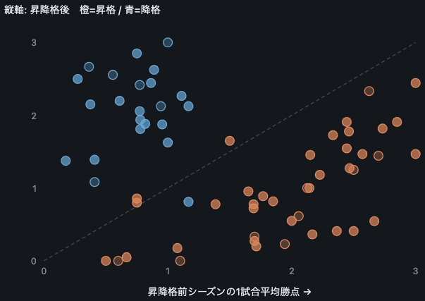
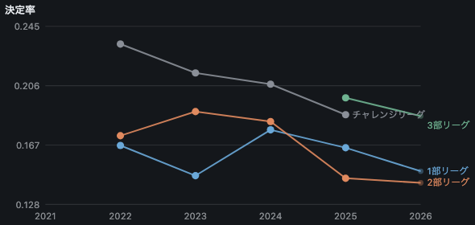
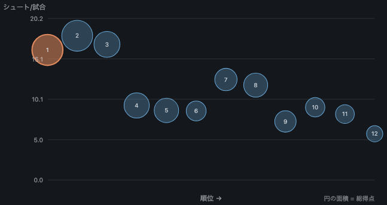

# 分析結果

*[English](FINDINGS.en.md)*

東京都大学サッカー連盟が公開している試合記録から得た、公式サイトには掲載されていない6つの分析結果です。試合結果は2021年から、選手単位の記録は2022年からを対象にしています。

連盟が公開しているのは日程・順位表・得点ランキングです。元の記録には、選手ごとのシュート数、先発メンバー、時刻付きの交代、反則種別付きのカード、そしてこの文書が最も重く使っている列 — 各選手の出身高校またはクラブユース — も含まれていますが、横断的な集計は公開されていません。

扱っているのはチーム・部・学年です。個人については何も書いていません。それが不足ではなく意図的な制約である理由は[最後の節](#この文書に載せていないもの)に書いてあります。

## 概要

「調べる前から予想できたか」で並べています。予想できなかったものが上です。

| | 結果 | 要点 |
|---|---|---|
| [1](#1-経歴は前シーズンの順位表より成績に影響) | 開幕前の予測 | 1試合も行われる前のメンバー表が、**前年の最終順位表より当たる**。部の平均に対して+12.8%、一方で前年の順位表だけを使うと**−0.2%**。 |
| [2](#2-部が変わったクラブは自分の順位表で説明できなくなる) | 昇降格 | 昇格で勝点が減るのは当たり前の側。読む価値があるのは、**降格したクラブでは前年の順位表が翌年をまったく予測しない**（r = **+0.017**）のに、名簿は+0.568で予測し続けるという方です。 |
| [3](#3-効果的でなかった2つのほうが効果的であった1つより情報量が多い) | 効果的でなかったもの | 設計として明らかに優れているはずの第2の外部指標を足しても、動いたのは**0.2ポイント**。同じものを測っていた（r = 0.866）ためです。学校を卒業生の成績で格付けする案は**悪化**させました。どちらも残してあります。 |
| [4](#4-学年差で一貫しているのは4年生の得点率だけ) | 学年 | 2026年の3年生に見えた傾向が、5シーズン並べると**消えた**。否定的な結果としてそのまま載せています。 |
| [5](#5-決定率は部が下がるほど上がるただし2部を除いて) | 部と決定率 | 決定率は部が下がるほど上がる。**ただし2部だけ**2025年に1部を下回り、戻っていません。検算に耐える説明が出なかったので、説明は書いていません。 |
| [6](#6-3位から下では順位表とシュート数が食い違う) | 順位・シュート・特徴 | 3位より下では、順位はシュート数ではなく決定率の順に並びます。チームの特徴は順位表に現れない差を分けます。 |

## データセット

2026年8月時点で連盟が公開している全リーグ戦・カップ戦。

| 年度 | シリーズ | 試合 | 出場記録 | シュート記録 | 交代 |
|---|---|---|---|---|---|
| 2026 | 4 | 350 | 6,633 | 8,564 | 1,720 |
| 2025 | 6 | 370 | 10,979 | 14,062 | 2,892 |
| 2024 | 6 | 426 | 12,451 | 15,795 | 3,227 |
| 2023 | 5 | 409 | 11,603 | 14,990 | 2,888 |
| 2022 | 5 | 410 | 11,396 | 13,611 | 2,915 |
| 2021 | 8 | 347 | 31 | 36 | 9 |

2,312試合、53,093件の出場記録、延べ356万分、7,748得点、53クラブ6,499選手。

## 数字の読み方

以下の数字の読み方を左右する点が4つあります。

**出場時間は復元値です。** 連盟が記録しているのは先発11人・ベンチ・時刻つきの交代であって、出場時間そのものは持っていません。ここに出てくる90分あたりの数値はすべてその3つから導いたもので、退場者の補正も入れてあります。退場した選手はレッドカードの時刻でピッチを離れますが、交代の記録には現れないため、別に処理しないとフル出場が付いてしまいます。

**選手単位の記録は2022年から**です。2021年は結果しか残っていません。データベースの構造が変わった際の名残で出場記録が数件だけ紛れており、そのまま扱うと決定率30.9という数字が出てしまうため、このシーズンについては分あたりの指標を算出しないことにしています。

**2026年は執筆時点で約6割の消化**です。表には載せていますが、図では薄く描いてあり、昇降格の平均からは除外しています。

**これは1つの大会の連続した6シーズンではありません。** 東京は2021年まで独自の4部制リーグを運営し、2022年に3部制へ再編。2023年に神奈川県大学リーグと統合して関東大学サッカーリーグ戦の東京・神奈川となり、その過程で1部12クラブのうち6クラブが上位へ抜けました。2025年に3部が新設され、2026年にチャレンジリーグが廃止されています。**1部に残留したクラブでも、2023年には1試合平均勝点が0.83増えており**、これは他の年度境界での変化の5倍です。以下の複数シーズンをまとめた分析には、この大会変更の影響が含まれます。詳しくは [docs/LEAGUE_STRUCTURE.ja.md](docs/LEAGUE_STRUCTURE.ja.md) を参照してください。

## 1. 経歴は前シーズンの順位表より成績に影響

このプロジェクトの他の節は、すでに始まっているシーズンを測っています。この節が測るのは始まる前の時点で、そこに存在する唯一の資料であるメンバー表です。全選手の名前、学年、そしてどこから来たかが、1試合も行われる前に公開されます。

ここから2つの指標を作ります。**経歴**は、その選手の出身高校が県予選を勝ち抜いて全国高校サッカー選手権に出場した回数です。第97〜104回大会という外部の資料で、このリーグについては何も知りません。**ユース比率**は、高体連ではなくプロクラブの下部組織から来た選手が名簿に占める割合です。

比較対象は1つだけで、前年の最終順位表です。採点は leave-one-season-out という交差検証で行います。各シーズンを他のシーズンだけで学習したモデルに予測させ、全シーズンぶんの予測をまとめて1回で採点しています。

**前シーズンがあるクラブ（n = 141）**

| モデル | RMSE | 部の平均に対して | r |
|---|---|---|---|
| 前年の順位表 | 1.0095 | **−0.2%** | +0.070 |
| 前年の順位表 ＋ 部の異動 | 0.9080 | +9.9% | +0.464 |
| 名簿だけ | 0.9171 | +9.0% | +0.414 |
| 名簿 ＋ ユース比率 | 0.9115 | +9.5% | +0.427 |
| 順位表 ＋ 部の異動 ＋ 名簿 | 0.8534 | +15.3% | +0.549 |
| **4つすべて** | **0.8496** | **+15.7%** | **+0.557** |

**全クラブ（n = 191、前シーズンがないクラブを含む）**

| モデル | RMSE | 部の平均に対して | r |
|---|---|---|---|
| 名簿だけ | 0.8942 | +10.6% | +0.448 |
| **名簿 ＋ ユース比率** | **0.8723** | **+12.8%** | **+0.489** |

最初の表の1行目を先に読んでください。**前年の最終順位表は、単独では「全クラブが部の平均になる」と予測するより悪い。** 「そのクラブが部を移ったかどうか」という、別のシーズンについての別の情報を足して、はじめて意味を持ちます。

名簿の側にはその補助が要りません。しかも対象が50クラブ・シーズン多い。昇格してきたばかりのクラブや、そもそも前年がないクラブにも使えるからで、そこはまさに予測が欲しい場面です。

妥当性の確認をひとつ。経歴の指標が、単に「そのクラブがどの部にいるか」を言い換えているだけではないか、という疑いは当然あります。特徴量はすべて、使う前にその部・そのシーズンの中で標準化しているので、モデルは階層を教えられていません。それでも階層を正しく並べます。

| 年度 | 1階層 | 2階層 | 3階層 | 4階層 |
|---|---|---|---|---|
| 2022 | 37.3% | 22.6% | 10.2% | – |
| 2023 | 27.4% | 14.5% | 11.3% | – |
| 2024 | 31.1% | 14.6% | 9.4% | – |
| 2025 | 31.8% | 16.8% | 12.2% | 6.8% |
| 2026 | 35.6% | 13.7% | 11.2% | – |

*名簿のうち選手権出場校の出身者が占める割合。順序が崩れたシーズンはありません。*

具体的な形も出しておきます。2026年を学習から外したうえで、2026年の1部をメンバー表だけから開幕前に並べるとこうなります。

| クラブ | 開幕前の予測 | 実際（6割消化） | 選手権出場校 | ユース |
|---|---|---|---|---|
| 帝京大学 | **+1.34** | +1.26 | 63% | 7% |
| 大東文化大学 | +1.19 | +0.30 | 57% | 14% |
| 武蔵大学 | +0.65 | −0.35 | 68% | 5% |
| 玉川大学 | +0.48 | −1.10 | 42% | 0% |
| 桜美林大学 | +0.23 | **+1.37** | 29% | 15% |
| 日本大学文理学部 | +0.14 | −0.67 | 38% | 2% |
| 横浜国立大学 | −0.26 | −0.24 | 16% | 3% |
| 上智大学 | −0.28 | −1.10 | 30% | 18% |
| 学習院大学 | −0.35 | +0.40 | 20% | 0% |
| 神奈川工科大学 | −0.45 | −1.64 | 13% | 3% |
| 朝鮮大学校 | −0.85 | **+0.19** | **0%** | 3% |

どちらの列も部の中で標準化してあるので、0が平均、単位はその部の標準偏差です。この11クラブでの相関は+0.384。実際の順位表で首位の東京経済大学がこの表にいないのは、2026年に復帰したクラブで前シーズンが存在しないためです。名簿だけのモデルなら扱えますが、この表のモデルは扱えません。

**一番外している行が、一番よく問題を説明しています。** 朝鮮大学校の名簿には、選手権に出場した高校の出身者が1人もいません。だからモデルは最下位に置き、実際は中位です。東京朝鮮高校はこの大会に参加していません。指標の作りからして見えないクラブで、それを追いかけた結果が3節です。

```bash
togakuren intake --validate      # 上の表すべて
togakuren intake --year 2026     # 開幕前の予測順
```

## 2. 部が変わったクラブは、自分の順位表で説明できなくなる



昇降格は、このデータセットで唯一の自然実験にあたります。同じチームが1年後に、相手だけを変えて戦う。5シーズンで終了した49件です。

| | 件数 | 1試合あたり勝点の変化 | 成績が落ちた数 |
|---|---|---|---|
| 昇格 | 32 | **−0.97** | 32件中29件 |
| 降格 | 17 | **+1.24** | 17件中1件 |

**ここまでは意外性がなく、この節の結果でもありません。** 上のカテゴリに行けば相手が強くなり、勝点は減ります。大きさは記録する価値がありますが、向きを議論する価値はありません。

意外なのは、部の異動が**予測可能性**に何をするかです。全クラブ・シーズンを「直前に何をしたか」で分け、それぞれの指標がこれから始まるシーズンをどれだけ当てるかを見ます。

| | クラブ数 | 前年の順位表 | 名簿 |
|---|---|---|---|
| 昇格 | 29 | +0.664 | +0.545 |
| **降格** | 24 | **+0.017** | **+0.568** |
| 同じ部に残留 | 88 | +0.494 | +0.325 |

**降格したクラブでは、自分の前年の順位表がまったく情報を持ちません。** 弱い情報ではなく、ゼロです（r = +0.017）。一方で同じクラブの名簿は+0.568で、これは名簿がこの表の他のどこでも出していない高さです。

すぐ思いつく反論は範囲制限です。降格クラブは全員が下位で終わっているのだから、前年の値がばらつかないのは当然ではないか。実際のばらつきは昇格クラブとほぼ同じで、標準偏差0.66に対して0.75。それでも昇格側は+0.664で機能しています。下りで信号を殺しているものは、上りでは殺していません。

ここから示唆される機構は、このデータで支持はできても証明はできません。**降格は選手の出来事で、昇格は調子の出来事**だということです。降格した大学は、その部に残していた選手を失います。だから順位はすでに一部が去った集団を説明した数字になる。昇格したクラブはおおむね同じ集団をより厳しい部へ連れて行きます。いずれにせよ実務上の帰結は1節と同じで、クラブが部を移ったら順位表を読むのをやめて名簿を読むべきです。

**この節に以前掲載していた非対称性の結論は撤回します。** 「昇格後の1試合平均勝点は約1.0下がる一方、降格後は約0.5しか上がらず、降格したチームの10件に3件はさらに悪化する」という主張でした。どちらも誤りです。チャレンジリーグは名称に番号がなく、2022〜2024年は3番目、2025年は4番目の階層でした。固定の対応表を使ったため、2022年に横移動または昇格していた13クラブを「降格」に分類していました。訂正後、降格したクラブの1試合平均勝点は+1.24となり、さらに悪化したのは17件中1件です。詳細は [docs/LEAGUE_STRUCTURE.ja.md](docs/LEAGUE_STRUCTURE.ja.md) にあります。

−0.97 自体は、どの再編で生じたかで切っても保たれます。2022年の再編時で−0.96、2023年の神奈川との統合時で−0.94、2025年の3部新設時で−1.18、階層が動かなかった境界で−0.95。リーグが作り直されたことの副産物なら、この分割で崩れるはずです。

## 3. 効果的でなかった2つのほうが、効果的であった1つより情報量が多い

1節の経歴指標には既知の欠陥があり、それを潰す手として明らかな案が2つあります。両方を実際に試して、両方外しました。成功より失敗のほうが問題の構造をよく説明するので、ここに残します。

**欠陥。** 選手権に出るとは県予選を勝ち抜くことで、県の難度は同じではありません。東京は約400校が2枠を争い、最も少ない県では数十校が1枠を争います。同じ実力の学校でも、東京の学校は出場記録がはるかに残りにくい。1節の朝鮮大学校の0%はその極端な例です。

**案1: トーナメントではなくリーグで測る。** 高円宮杯JFA U-18サッカーリーグは、プレミア・プリンス・都道府県という所属ディビジョンで学校を格付けします。1つの県の1つの大会を勝ち抜いたかどうかに依存せず、Jクラブのアカデミーも同じ表に載ります。設計として明らかに優れているはずでした。JFAの公開ページからプレミアとプリンスの8シーズン分、延べ42サイドと284サイドを集めました。

優れていませんでした。選手権に足しても+15.7%が+15.8%になるだけで、単独では+14.3%と、選手権の+15.3%よりわずかに劣ります。

理由のほうが試行より価値があります。**2つの指標の相関は r = 0.866。** 同じ情報が服を着替えていただけで、しかも理由が同じでした。プリンスは1地域あたり約20チームなので、階層が付くのは名簿の21%です。選手権も21%。**残る79%の選手はどちらでも階層なしのまま**です。東京・神奈川の大学に来る選手の出身校は、プリンスの**下**にある都県リーグにいます。県の競争度の問題を、地域の競争度の問題に置き換えただけでした。仮説を立てる根拠になった6校は、1校も救済されていません。東京朝鮮高校はどちらの体系でも階層なしです。

**案2: 沈黙している79%を、データの内側から埋める。** 各学校を「その卒業生がこのリーグでどれだけ出場したか」で格付けし、外部指標が何も言わない選手にだけ当てる。取得コストはゼロで、データはすでに手元にあります。

試したどの組み合わせでも悪化しました。+15.7%が+15.5%、+15.8%が+15.6%です。この内生指標の部内相関は+0.152しかなく、しかも漏れ対策は最初から入れてありました。系列校は毎年1つの大学へ学年ごと送るので、「その学校の卒業生がどれだけ出場したか」は「どの大学へ行ったか」を部分的に符号化します。だから各学校の格付けから対象クラブと対象シーズンを除外していますが、それは必要条件であって十分条件ではなかったということです。

**2つの失敗が合わせて言っていること。** 開幕前の信号は「この名簿は全国的に名の通った学校・クラブの出身者で埋まっているか」という1つの問いでほぼ尽きており、その答えは名簿の5分の1についてしか存在しません。同じ5分の1を別の物差しで測り直しても0.2ポイント、残る5分の4に物差しを作ろうとすると0.2ポイント失う。残っている誠実な選択肢は連続量を取る路線、たとえば選手権予選をどこまで勝ち上がったかですが、上の2つが外れた後としては有望とは言えません。

*高円宮杯のデータはこのリポジトリに同梱しておらず、この節の数字はここからは再現できません。それでも書き残しているのは、この実験に実際の収集コストがかかったからで、否定的な結果の価値は、他の誰かが繰り返さずに済む作業量とちょうど同じだけあります。*

## 4. 学年差で一貫しているのは4年生の得点率だけ


学年別の90分あたり得点、1部のみ。部をまたぐと母集団が混ざるので、1部の中だけで見ています。

| | 2022 | 2023 | 2024 | 2025 | 2026 |
|---|---|---|---|---|---|
| 1年 | 0.086 | 0.118 | 0.044 | 0.122 | 0.118 |
| 2年 | 0.140 | 0.120 | 0.126 | **0.074** | 0.146 |
| 3年 | 0.128 | 0.124 | 0.161 | **0.169** | **0.117** |
| 4年 | 0.167 | 0.136 | 0.167 | 0.148 | **0.178** |

2026年の3年生は0.117で、5シーズンで最も低い3年生の数字です。これだけを見ると「大学3年目に何かある」という話に見えます。しかし2025年の3年生は表の中で**最も高い**0.169で、その年に落ち込んでいたのは2年生でした。低く見える学年は毎年入れ替わります。これは世代差の現れ方であって、構造の現れ方ではありません。

一貫しているのは4年生だけで、5シーズン中3シーズンで最も高く、最下位になったことは一度もありません。これは否定的な結果であり、1シーズンだけの数字で学年について結論を出してはいけない理由でもあります。

実際に変化した点が1つ。1部の出場時間に占める1年生の割合は、2024年の5.5%に対して2026年は9.5%と、2022年以来の高さです。

## 5. 決定率は部が下がるほど上がる、ただし2部を除いて



| | 2022 | 2023 | 2024 | 2025 | 2026 |
|---|---|---|---|---|---|
| 1部 | 0.167 | 0.147 | 0.177 | 0.165 | 0.150 |
| 2部 | 0.173 | 0.189 | 0.182 | **0.145** | **0.142** |
| 3部 | – | – | – | 0.198 | 0.186 |
| チャレンジ | 0.233 | 0.214 | 0.207 | 0.187 | – |

守備が弱いほど決定機を止めきれません。だから下部リーグほど高い率で決まります。2022年のチャレンジリーグは0.233、同年の1部は0.167でした。3部はここに存在する2シーズンとも、この傾向どおりです。

2部だけが外れます。3シーズン1部を上回っていたのに、2025年に下回ってそのまま戻っていません。この表の真ん中を貫いている再編は、いまは文書化されています。2024年の2部19チーム編成は3部新設前の受け皿の年であり、比較相手のチャレンジリーグは2025年に階層が変わり2026年には消滅しています（[docs/LEAGUE_STRUCTURE.ja.md](docs/LEAGUE_STRUCTURE.ja.md)）。ただしそれが分かっても交差そのものは説明できません。2025年の2部は10チームで、これは大半のシーズンと同じ規模です。判断は引き続き保留します。

## 6. 3位から下では、順位表とシュート数が食い違う



横軸が順位、縦軸が1試合あたりのシュート数、円の面積が総得点。2026年の1部12チームのうち5チームが、シュート数の順位と3つ以上離れた位置にいます。

| チーム | 順位 | シュート数の順位 | シュート/試合 | 決定率 |
|---|---|---|---|---|
| 横浜国立大学 | 7 | **4** | 12.5 | 0.110 |
| 武蔵大学 | 8 | **5** | 11.8 | 0.143 |
| 玉川大学 | 10 | **7** | 9.1 | 0.102 |
| 大東文化大学 | 5 | 8 | 8.7 | 0.204 |
| 朝鮮大学校 | 6 | 9 | 8.6 | 0.116 |

上位3チームは両方をこなしています。最も多く打ち、最も多く決める。だから2つの軸が一致します。そこから下は、シュート数ではなく決定率の順に並びます。横浜国立大学は3位のチームと同じだけ打って決定率が半分、大東文化大学は上位半分で最もシュートが少ないのに決定率0.204です。


同じクラブを6指標で見たものです。指標はシュート数、決定率、守備、ターンオーバー（主力11人以外が占める出場時間の割合）、下級生比率（1・2年生が占める出場時間の割合）、後半の比重（後半に打ったシュートの割合）で、それぞれシーズン内で0〜100に換算しています。頂点の番号1〜6はこの順で、上から時計回りに並んでいます。点線はリーグ平均ですが、どの指標もシーズン内で相対化しているためこの平均は50になりません。多くのチームが上位に集まる指標では高く、1クラブが長い尾を引いている指標では低くなります。

2026年の各指標の両端は、6つの別々のクラブに散らばっています。

| 指標 | 最高 | 最低 |
|---|---|---|
| シュート数 | 桜美林大学 (2位) | 神奈川工科大学 (12位) |
| 決定率 | 学習院大学 (4位) | 神奈川工科大学 (12位) |
| 守備 | 帝京大学 (3位) | 神奈川工科大学 (12位) |
| ターンオーバー | 大東文化大学 (5位) | 横浜国立大学 (7位) |
| 下級生比率 | 武蔵大学 (8位) | 桜美林大学 (2位) |
| 後半の比重 | 帝京大学 (3位) | 朝鮮大学校 (6位) |

3指標以上で極端なのは最下位のクラブだけで、しかも当然の方向にです。残りの指標は順位とほとんど関係がなく、横浜国立大学はリーグで最も選手を入れ替えないチームでありながら7位、大東文化大学は最も入れ替えるチームで5位、武蔵大学は最も若いチームで8位です。

## この文書に載せていないもの

2026年の1部で最も目を引く単一の数字は、チームではなく個人のものです。90分あたり7.34本、2位のおよそ2倍で、13試合中6試合の先発。得点ランキングにはまったく現れません。

その選手の名前はここにありませんし、他の誰の名前もありません。

この記録に載っているのはアマチュアの学生です。連盟が名前を公開しているのは連盟が大会を運営しているからであって、第三者がそれを再公開するのとは別のことです。選手単位の行は個人情報にあたり、名前を消しても解決しません。1部で270分以上出場した189人のうち105人が、チーム・ポジション・出場数という分析に必要なだけの3列で一意に定まります。

1節はこの状況を改善するどころか悪化させるので、そこははっきり書いておきます。開幕前予測がまるごと乗っている出身校の列を足すと、同じ部の一意な行は105件から**189件中184件**に増えます。だからこのプロジェクトで出身校が現れるのはクラブ単位の平均としてだけで、どのプライバシーモードでも選手の行には載りません。表と根拠は [docs/DATA_POLICY.ja.md](docs/DATA_POLICY.ja.md) にあり、`privacy-check` で再現できます。

選手単位の処理はすべて手元で動き、その元になるデータベースをこのリポジトリは同梱していません。

## 関連ドキュメント

- [docs/LEAGUE_STRUCTURE.ja.md](docs/LEAGUE_STRUCTURE.ja.md) — このデータセットに含まれる3回の再編、それが2節に与えた影響、そして撤回した1件
- [docs/SEASON_TRENDS.ja.md](docs/SEASON_TRENDS.ja.md) — 2・4・5節の裏にある全表。部の異動の一覧と、全クラブの所属部の推移を含む
- [docs/DATA_POLICY.ja.md](docs/DATA_POLICY.ja.md) — 何を公開してよいかを、仮定ではなく実測で決めた記録
- [docs/seasons/](docs/seasons/) — 2021〜2026年の各シーズン・各部のチーム分析、40本
- [docs/PLAYER_ANALYSIS_SAMPLE.ja.md](docs/PLAYER_ANALYSIS_SAMPLE.ja.md) — 架空シーズンでの選手単位の出力

## 再現手順

```bash
pip install .
togakuren ingest                                 # 約40秒
togakuren intake --validate                      # 1節と、2節の分割
togakuren intake --year 2026                     # 1節の開幕前の予測順
togakuren trends                                 # 2・4・5節
togakuren dashboard --series "2026 1部"          # 6節
togakuren privacy-check --series "2026 1部"      # 最後の節
togakuren trends --format md --lang ja           # docs/SEASON_TRENDS.ja.md
togakuren profiles --all                         # docs/seasons/
```

図はこの2ページ、`trends` と `dashboard --privacy aggregate` の実際のチャートを1枚ずつ切り出して撮影したものです。この文書の数字は、3節で明示している例外を除いて、1つも手で打っていません。

どの図がどのチャートかは [docs/FIGURES.ja.md](docs/FIGURES.ja.md) にあります。
