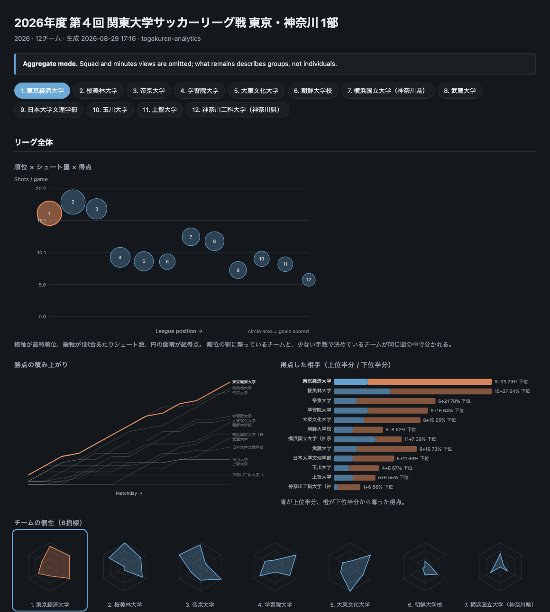

# togakuren-analytics

[](https://github.com/sean-from-japan/togakuren-analytics/actions/workflows/ci.yml)


Match records from the Tokyo University Football Association
(東京都大学サッカー連盟), turned into a database and a set of measurements.
**2,312 fixtures, 53 clubs, 2021–2026 (player-level records from 2022), no
dependencies outside the standard library, and no collected data in the
repository.**

The federation's site shows fixtures, a table and a top-scorers list. The records
underneath hold per-player shot counts, lineups, timed substitutions and coded
cards, and none of it is aggregated anywhere.

## What came out of it

| | result | where |
|---|---|---|
| **Forecasting** | Settings frozen on 2022–24; on 2025–26 (n=525) log loss goes **1.0200 → 0.8192**, past Elo at 0.8753. Accuracy 44.6% → 65.7%. The time decay is the whole story — removing it costs 0.095 nats, more than the model's entire margin over Elo. | [PREDICTION.md](docs/PREDICTION.md) · [ja](docs/PREDICTION.ja.md) |
| **Player ratings** | Adjusted plus-minus over 8,087 lineup segments. Knowing the players beats knowing only the clubs by **+3.73%** (cross-validated) and **+4.06%** (forward split), with the ridge penalties chosen *inside* each training fold. | [RATINGS.md](docs/RATINGS.md) · [ja](docs/RATINGS.ja.md) |
| **What the data cannot do** | Goal records carry a scorer and a minute and nothing else, so **penalties cannot be separated from open play** — no non-penalty rate is possible from this source. Goal events reconcile with the recorded score in **79%** of fixtures. | [FINDINGS.md](FINDINGS.md) |
| **What may be published** | Names removed is not anonymous: club, position and appearances alone identify **56%** of a division uniquely, and 77% once goals are added. Measured, not assumed — `privacy-check` reproduces it. | [DATA_POLICY.md](docs/DATA_POLICY.md) · [ja](docs/DATA_POLICY.ja.md) |

Two things were worked out here that the source documents nowhere: the four shot
columns are halves and extra time rather than quarters (the fourth is never used
in five seasons), and minutes played are not recorded at all — they are rebuilt
from the eleven, the bench and free-text substitution times, which include `HT`,
`90+2` and a full-width `90⁺5`.

**No collected data is committed here.** The repository is code, and the people
in this dataset are amateur students — see
[docs/DATA_POLICY.md](docs/DATA_POLICY.md). CI fails if collected data appears in
a commit.

📊 **[Findings](FINDINGS.md)** ([日本語](FINDINGS.ja.md)) — six results with the
charts, including two that came out against expectation.



*Above: the dashboard in aggregate mode, which omits every per-player view. The
local version adds the squad table and a matchday-by-player minutes grid.*

## Documents

| | |
|---|---|
| [FINDINGS.md](FINDINGS.md) · [ja](FINDINGS.ja.md) | Six results with the charts. Start here. |
| [docs/SEASON_TRENDS.md](docs/SEASON_TRENDS.md) · [ja](docs/SEASON_TRENDS.ja.md) | Every season in one place: league level, year groups, all 57 division changes, every club's path. Generated. |
| [docs/seasons/](docs/seasons/) | One document per league season and division, 2021–2026: table, indices, year groups, history. 40 documents, generated. |
| [docs/PLAYER_ANALYSIS_SAMPLE.md](docs/PLAYER_ANALYSIS_SAMPLE.md) · [ja](docs/PLAYER_ANALYSIS_SAMPLE.ja.md) | What the player-level output looks like, over an **invented** season. Generated. |
| [docs/PREDICTION.md](docs/PREDICTION.md) · [ja](docs/PREDICTION.ja.md) | Forecasting the fixtures still to play, scored against the class prior on seasons the settings were not chosen on. |
| [docs/RATINGS.md](docs/RATINGS.md) · [ja](docs/RATINGS.ja.md) | Adjusted plus-minus: what knowing the players adds over knowing the clubs, and the two mistakes that reverse the answer. |
| [docs/SOURCE_SELECTION.md](docs/SOURCE_SELECTION.md) · [ja](docs/SOURCE_SELECTION.ja.md) | Why this league and not the tier above: what each federation publishes, and what its site says about being read by a program. |
| [docs/DATA_POLICY.md](docs/DATA_POLICY.md) · [ja](docs/DATA_POLICY.ja.md) | What may be published, what may not, and the measurements behind the answer. |
| [CHANGELOG.md](CHANGELOG.md) | What changed and, where a published figure moved, why it moved. |

The two generated documents come out of the tool in both languages
(`--lang en|ja`), so only prose is ever translated by hand and the numbers
cannot drift between versions. Regenerate them with:

```bash
togakuren trends --format md --out docs/SEASON_TRENDS.md
togakuren profiles --all                 # docs/seasons/, both languages
togakuren sample --out docs/PLAYER_ANALYSIS_SAMPLE.md
```

Seasons before 2026 are over, so their documents never change: the same code
over the same records reproduces them byte for byte. That is why they are
committed rather than left to be regenerated.

## Install

Python 3.9 or newer. No dependencies — standard library only, including the
charts.

```bash
git clone https://github.com/sean-from-japan/togakuren-analytics
cd togakuren-analytics
pip install .          # or run it in place with python3 -m togakuren
```

## Use

```bash
# every season the federation still publishes (~2,300 fixtures, about 40 seconds)
togakuren ingest

# or just one year
togakuren ingest --year 2026

togakuren list                                       # what is loaded
togakuren dashboard --series "2026 1部"              # interactive, team selector
togakuren report --series "2026 1部"                 # flat standalone HTML
togakuren export --series "2026 1部" --out d1.csv    # per-player season rows
togakuren trends                                     # every season at once
togakuren profiles --series "2026 1部"               # one division as Markdown
togakuren profiles --all                             # every completed season
togakuren sample                                     # player-level output, invented data
togakuren privacy-check --series "2026 1部"          # how identifiable an export is

togakuren forecast --series "2026 1部"                # odds for the fixtures left to play
togakuren backtest --league-only                     # how well those odds have done
togakuren ratings --validate                         # what player identity is worth
togakuren ratings                                    # adjusted plus-minus, locally
```

`--series` takes a series id or any set of search terms that narrows to one
series, so `"2026 1部"` is enough.

### What the dashboard shows

Both views are one self-contained file with no external assets — no CDN, no
build step, no server.

**League level**

- **Position × shot volume × goals.** Rank on the x axis, shots per game on the
  y, total goals as circle area. A side that shoots a lot without scoring
  separates visibly from one that converts a handful of chances.
- **Six-axis team fingerprints** — shot volume, finishing, defence, rotation,
  youth and late push, each scaled within the series. Twelve small radars side by
  side make a settled veteran side and a young rotating one different *shapes*,
  not different numbers.
- **Points accumulated by matchday**, all teams at once, the selected one
  highlighted.
- **Goals split by the opponent's half of the table** — feasting on the bottom
  and going quiet against the top looks identical in a goals column.

**Team level**, behind a selector button

- **A matchday × player minutes grid.** The single most useful view for a
  squad: who actually plays, who rotates, who disappears after a certain week. A
  settled side is a solid block; a rotated one is mottled.
- **Minutes and goals by academic year**, plus mean year weighted by minutes.
- **The club's history across divisions**, followed by its federation-wide id, so
  relegation and promotion appear as a change of division on consecutive rows.
- The full squad table with per-90 rates.

**Across seasons** (`togakuren trends`)

One season answers who is good now; several answer the questions that made the
backfill worth doing. Aggregates throughout, so this page is publishable as it
stands.

- **League level over time** — goals, shots and conversion per division, with
  seasons still in progress drawn faintly so they are not mistaken for finished
  ones.
- **Academic year over time**, per division: minutes share as stacked columns
  and scoring rate as a line. Enough seasons to tell a real pattern from one
  cohort being strong.
- **Club trajectories** — tier on an inverted axis, so promotion reads as the
  line going up, sized by points per game.
- **Promotion and relegation as a natural experiment** — the same squad, a year
  later, against different opposition.

The database and the response cache go to a per-user data directory
(`~/Library/Application Support/togakuren-analytics` on macOS,
`$XDG_DATA_HOME` elsewhere), not the working directory. Override with
`$TOGAKUREN_HOME`, `--db` or `--cache`.

## What gets collected

| Table | Contents |
|---|---|
| `series` | one row per competition-season |
| `games` | fixtures: section, kickoff, venue, regulation length |
| `game_teams` | one row per team per fixture: score, points, fair-play points |
| `appearances` | who played, in which role, and **for how many minutes** |
| `squad_members` | academic year, shirt number, position — the year group data |
| `shots` | per player per match, split into halves and extra time |
| `events` | goals and cards with the minute and the offence code |
| `substitutions` | who came off, who came on, when |
| `standings` | the league table the federation computes |
| `players` | names — the only free-text personal data, and droppable |

A full backfill as of August 2026:

| Season | Series | Fixtures | Appearances | Shot rows | Substitutions |
|---|---|---|---|---|---|
| 2026 | 4 | 350 | 6,633 | 8,564 | 1,720 |
| 2025 | 6 | 370 | 10,979 | 14,062 | 2,892 |
| 2024 | 6 | 426 | 12,451 | 15,795 | 3,227 |
| 2023 | 5 | 409 | 11,603 | 14,990 | 2,888 |
| 2022 | 5 | 410 | 11,396 | 13,611 | 2,915 |
| 2021 | 8 | 347 | 31 | 36 | 9 |

2,312 fixtures, 53,093 appearances, 3.56 million player-minutes, 7,748 goals,
6,499 players across 53 clubs. Player-level recording begins in 2022; 2021
predates the schema change and has results only.

## How it works

**The source is an API, not HTML.** The federation's site is a Vue single-page
application rendered from a Cockpit CMS instance, so there is no page scraping —
the data arrives as JSON. The read token is one the site ships to every browser;
this client reads it out of the site's own `common.js` at runtime rather than
hardcoding it, so a rotated token is picked up automatically and no credential
lives in this repository. Requests are throttled and every response is cached, so
re-running costs nothing.

**Minutes are reconstructed, not recorded.** The federation stores a starting
eleven, a bench and timed substitutions, and never a minutes-played figure. The
whole point of the exercise — any per-90 metric — depends on deriving it, and the
edge cases are where the interesting bugs live:

- Substitution times are free text entered by match officials: a plain number, the
  half-time marker `HT`, stoppage time as `90+2`, and at least once a superscript
  `90⁺5`. All four appear in the real data and all four parse.
- A player sent off leaves the pitch at the minute of the red card. The
  substitution list does not record it, so without handling cards separately a
  dismissed player is credited with the full match.
- An unparseable time is skipped rather than guessed, and the affected player
  keeps a defensible default instead of a fabricated one.

**What the undocumented columns mean.** Shot counts are stored under four keys
named `first` to `fourth`. Checking every season shows `third` is non-zero only in
knockout ties that went to extra time and `fourth` is never used at all, so they
are the two halves followed by the two extra-time halves. The schema names them
that way.

## Privacy

The squad lists carry names, kana, dates of birth, heights, weights and former
schools of amateur students. The federation publishing them is not the same as a
third party redistributing them, so the tool is built to make the safe thing the
easy thing:

- `--privacy aggregate` emits no per-player rows at all.
- `--privacy pseudonym` uses salted, non-reversible labels and states the residual
  risk on the report itself.
- `--privacy initials` exists and is **refused** for anything marked `--public`.
- `--public` refuses to write an unsafe file rather than warning about it.
- `ingest --drop-personal-data` deletes every name and squad detail, keeping only
  opaque ids. All the metrics still work; the tests assert it.

Initials are not anonymisation, and `privacy-check` measures rather than assumes
it. On the 2026 first division, of 189 players above 270 minutes, **105 (56%) are
unique on team, position and appearances alone** — three ordinary analytical
columns, against squad lists the federation already publishes. Removing the name
does not help. [docs/DATA_POLICY.md](docs/DATA_POLICY.md) has the full table and
the reasoning.

## Tests

```bash
python3 -m unittest discover -s tests -t . -v
```

113 tests, no network access, no fixtures taken from the federation — the test data
is invented clubs and invented people. CI runs them on Linux, macOS and Windows
against Python 3.9 and 3.13, and fails the build if any collected data is ever
committed.

## Licence

MIT — see [LICENSE](LICENSE). It covers this code. It says nothing about the
federation's data, which the tool does not redistribute.

## Not affiliated

An independent hobby project, not endorsed by or connected to the Tokyo University
Football Association. It reads only what their site already publishes.

Every figure is computed from the federation's public records. Nothing
unpublished is used, every club goes through the same code, and no club is
favoured or singled out.

If the federation, or any club whose results appear here, would prefer this not to
exist, open an issue and it comes down.
