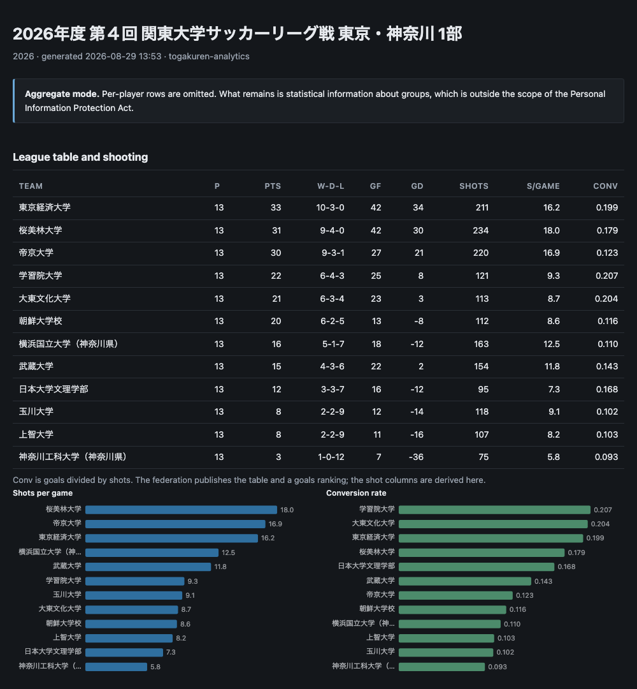

# togakuren-analytics

Collect and analyse match records from the Tokyo University Football Association
(東京都大学サッカー連盟), which runs the Tokyo/Kanagawa university leagues.

The federation publishes fixtures, results and a top-scorers list. The records
behind them are far more detailed than the pages let on — per-player shot counts,
the starting eleven, timed substitutions, cards with offence codes — and none of
it is aggregated anywhere. This turns those records into a queryable database and
the rate metrics the site never shows: minutes played, shots per 90, conversion
rate, when a team's shots and substitutions actually arrive.

**No collected data is committed here.** The repository is code, and the people in
this dataset are amateur students — see [docs/DATA_POLICY.md](docs/DATA_POLICY.md).



## Install

Python 3.9 or newer. No dependencies — standard library only, including the
charts.

```bash
git clone https://github.com/sean-from-japan/togakuren-analytics
cd togakuren-analytics
pip install .          # or run it in place with python3 -m togakuren
```

## Use

```bash
# every season the federation still publishes (~2,300 fixtures, about 40 seconds)
togakuren ingest

# or just one year
togakuren ingest --year 2026

togakuren list                                  # what is loaded
togakuren report --series "1部"                 # standalone HTML, opens anywhere
togakuren export --series "1部" --out d1.csv    # per-player season rows
togakuren privacy-check --series "1部"          # how identifiable an export is
```

The database and the response cache go to a per-user data directory
(`~/Library/Application Support/togakuren-analytics` on macOS,
`$XDG_DATA_HOME` elsewhere), not the working directory. Override with
`$TOGAKUREN_HOME`, `--db` or `--cache`.

## What gets collected

| Table | Contents |
|---|---|
| `series` | one row per competition-season |
| `games` | fixtures: section, kickoff, venue, regulation length |
| `game_teams` | one row per team per fixture: score, points, fair-play points |
| `appearances` | who played, in which role, and **for how many minutes** |
| `shots` | per player per match, split into halves and extra time |
| `events` | goals and cards with the minute and the offence code |
| `substitutions` | who came off, who came on, when |
| `standings` | the league table the federation computes |
| `players`, `squad_members` | squad lists — the only personal data, and droppable |

A full backfill as of August 2026:

| Season | Series | Fixtures | Appearances | Shot rows | Substitutions |
|---|---|---|---|---|---|
| 2026 | 4 | 350 | 6,633 | 8,564 | 1,720 |
| 2025 | 6 | 370 | 10,979 | 14,062 | 2,892 |
| 2024 | 6 | 426 | 12,451 | 15,795 | 3,227 |
| 2023 | 5 | 409 | 11,603 | 14,990 | 2,888 |
| 2022 | 5 | 410 | 11,396 | 13,611 | 2,915 |
| 2021 | 8 | 347 | 31 | 36 | 9 |

2,312 fixtures, 53,093 appearances, 3.56 million player-minutes, 7,748 goals,
6,499 players across 53 clubs. Player-level recording begins in 2022; 2021
predates the schema change and has results only.

## How it works

**The source is an API, not HTML.** The federation's site is a Vue single-page
application rendered from a Cockpit CMS instance, so there is no page scraping —
the data arrives as JSON. The read token is one the site ships to every browser;
this client reads it out of the site's own `common.js` at runtime rather than
hardcoding it, so a rotated token is picked up automatically and no credential
lives in this repository. Requests are throttled and every response is cached, so
re-running costs nothing.

**Minutes are reconstructed, not recorded.** The federation stores a starting
eleven, a bench and timed substitutions, and never a minutes-played figure. The
whole point of the exercise — any per-90 metric — depends on deriving it, and the
edge cases are where the interesting bugs live:

- Substitution times are free text entered by match officials: a plain number, the
  half-time marker `HT`, stoppage time as `90+2`, and at least once a superscript
  `90⁺5`. All four appear in the real data and all four parse.
- A player sent off leaves the pitch at the minute of the red card. The
  substitution list does not record it, so without handling cards separately a
  dismissed player is credited with the full match.
- An unparseable time is skipped rather than guessed, and the affected player
  keeps a defensible default instead of a fabricated one.

**What the undocumented columns mean.** Shot counts are stored under four keys
named `first` to `fourth`. Checking every season shows `third` is non-zero only in
knockout ties that went to extra time and `fourth` is never used at all, so they
are the two halves followed by the two extra-time halves. The schema names them
that way.

## Privacy

The squad lists carry names, kana, dates of birth, heights, weights and former
schools of amateur students. The federation publishing them is not the same as a
third party redistributing them, so the tool is built to make the safe thing the
easy thing:

- `--privacy aggregate` emits no per-player rows at all.
- `--privacy pseudonym` uses salted, non-reversible labels and states the residual
  risk on the report itself.
- `--privacy initials` exists and is **refused** for anything marked `--public`.
- `--public` refuses to write an unsafe file rather than warning about it.
- `ingest --drop-personal-data` deletes every name and squad detail, keeping only
  opaque ids. All the metrics still work; the tests assert it.

Initials are not anonymisation, and `privacy-check` measures rather than assumes
it. On the 2026 first division, of 189 players above 270 minutes, **105 (56%) are
unique on team, position and appearances alone** — three ordinary analytical
columns, against squad lists the federation already publishes. Removing the name
does not help. [docs/DATA_POLICY.md](docs/DATA_POLICY.md) has the full table and
the reasoning.

## Tests

```bash
python3 -m unittest discover -s tests -t . -v
```

57 tests, no network access, no fixtures taken from the federation — the test data
is invented clubs and invented people. CI runs them on Linux, macOS and Windows
against Python 3.9 and 3.13, and fails the build if any collected data is ever
committed.

## Licence

MIT — see [LICENSE](LICENSE). It covers this code. It says nothing about the
federation's data, which the tool does not redistribute.

## Not affiliated

An independent hobby project, not endorsed by or connected to the Tokyo University
Football Association. It reads only what their site already publishes. If they
would prefer it not to exist, open an issue and it comes down.
