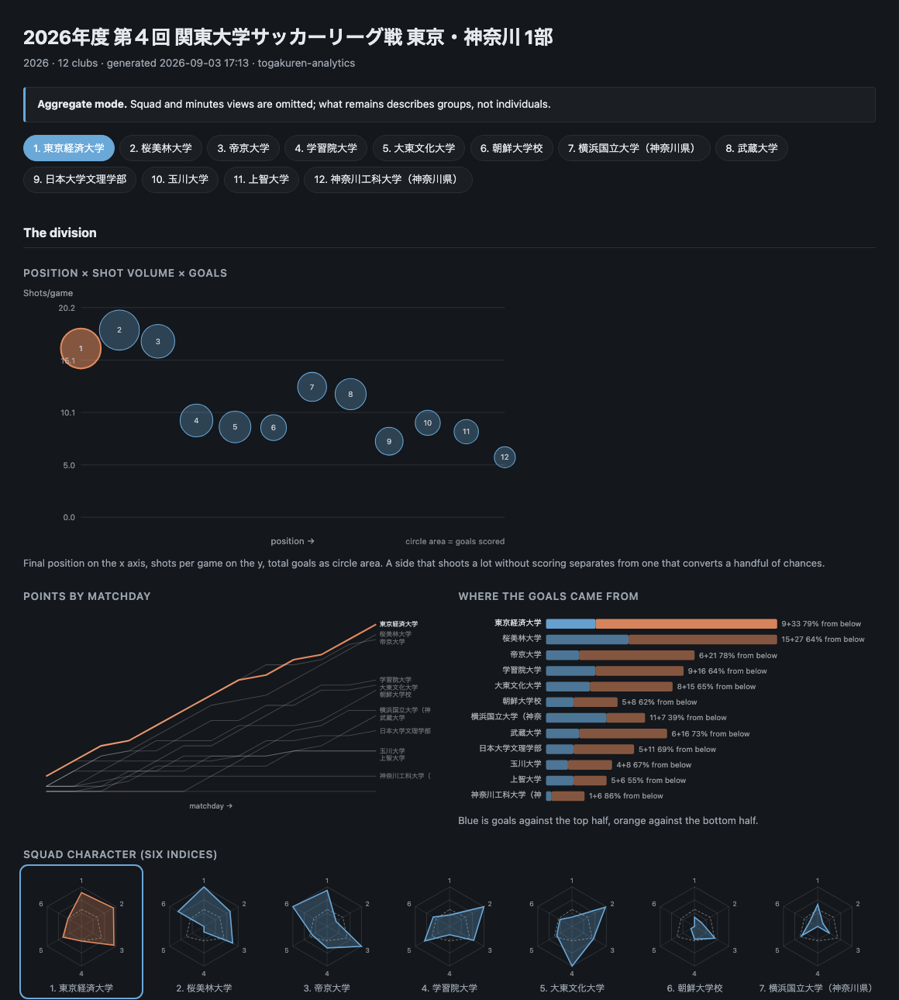

# togakuren-analytics

[日本語](README.ja.md) | [English](README.en.md)

[](https://github.com/sean-from-japan/togakuren-analytics/actions/workflows/ci.yml)


東京都大学サッカー連盟の公開記録を、データベースと検証つきの分析に変えるPythonツールです。2,312試合・53クラブ・2021〜2026年を扱い、依存は標準ライブラリだけ、収集したデータはリポジトリに含みません。

A standard-library-only Python toolkit that turns the Tokyo University Football Association's published match records into a database and a set of tested measurements: 2,312 fixtures, 53 clubs, 2021–2026, and no collected data in the repository.



## 主な結果

- **開幕前のメンバー表が、前年の最終順位表より当たります。** 出身高校とクラブユース出身者の比率だけで、部の平均に対して+12.8%。前年の順位表だけでは−0.2%です。
- **勝敗予測は、設定を決めた後の597試合で検証しています。** 対数損失は1.0174 → 0.8211で、Eloの0.8672を上回りました。
- **間違いと失敗も残しています。** リーグ再編の読み違いで昇降格の21%を逆に分類していたことが分かり、その結果に基づく主張を撤回しました。改善するはずだった2つの案が外れた経緯も書いています。
- **名前を消しても匿名にはなりません。** チーム・ポジション・出場数だけで2026年1部の選手の56%が特定できることを実測し、公開用の出力はそれを前提に制限しています。

## Highlights

- **The squad list beats last year's table.** Published before a ball is kicked, it scores +12.8% against the division average; last year's final table alone scores −0.2%.
- **Forecasts are scored on fixtures the settings never saw.** On 597 held-out fixtures, log loss goes 1.0174 → 0.8211, past Elo at 0.8672.
- **Mistakes and failures stay on the record.** A misread league reorganisation reversed 21% of division changes and one claim was withdrawn; two well-motivated improvements that failed are written up.
- **Removing names is not anonymisation.** Club, position and appearances alone identify 56% of the 2026 first division, so public output is restricted accordingly.

詳しくは / Read more: [FINDINGS.ja.md](FINDINGS.ja.md) · [FINDINGS.en.md](FINDINGS.en.md)

## Quick start

```bash
git clone https://github.com/sean-from-japan/togakuren-analytics
cd togakuren-analytics
pip install .
togakuren ingest                                   # about 40 seconds
togakuren dashboard --series "2026 1部" --forecast
```

Not affiliated with the Tokyo University Football Association. 東京都大学サッカー連盟とは無関係の個人プロジェクトです。
