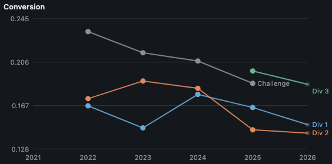
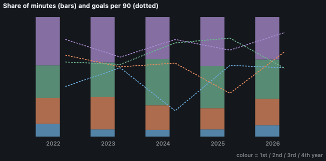
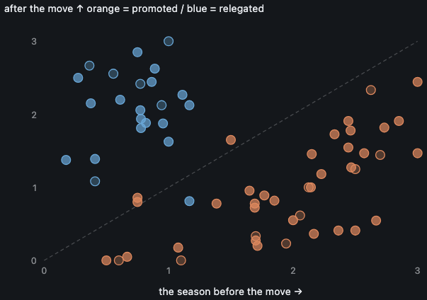

# Across seasons — 2021–2026

*[日本語](SEASON_TRENDS.ja.md)*

Every completed season in one place. Seasons before 2026 are finished, so these tables are fixed: the same code over the same records reproduces them exactly. Aggregates only — no individual appears here.

Snapshot of 2021–2026, generated 2026-09-03. Regenerate with `togakuren trends --format md --lang en`.

## Seasons

| Season | Division | Teams | Fixtures | Played | Goals/game | Shots/game | Conv | Yellows/game | Reds |
| --- | --- | --: | --: | --: | --: | --: | --: | --: | --: |
| 2021 | 1部リーグ | 13 | 156 | - | 2.77 | - | - | 1.54 | 2 |
| 2021 | 2部リーグ | 10 | 90 | - | 3.14 | - | - | 1.13 | 0 |
| 2021 | 3部リーグ | 10 | 45 | - | 4.33 | - | - | 0.36 | 1 |
| 2021 | 4部リーグ | 8 | 28 | - | 2.89 | - | - | 0.25 | 0 |
| 2022 | 1部リーグ | 12 | 132 | - | 3.11 | 18.6 | 0.167 | 1.70 | 3 |
| 2022 | 2部リーグ | 11 | 110 | - | 3.54 | 20.4 | 0.173 | 1.39 | 4 |
| 2022 | チャレンジリーグ | 16 | 119 | - | 5.15 | 22.1 | 0.233 | 0.57 | 0 |
| 2023 | 1部リーグ | 12 | 132 | - | 2.81 | 19.1 | 0.147 | 1.84 | 3 |
| 2023 | 2部リーグ | 12 | 132 | - | 3.85 | 20.4 | 0.189 | 1.20 | 2 |
| 2023 | チャレンジリーグ | 14 | 91 | - | 4.66 | 21.7 | 0.214 | 1.11 | 1 |
| 2024 | 1部リーグ | 12 | 132 | - | 3.45 | 19.5 | 0.177 | 1.84 | 5 |
| 2024 | 2部リーグ | 19 | 170 | - | 3.77 | 20.7 | 0.182 | 1.54 | 7 |
| 2024 | チャレンジリーグ | 9 | 72 | - | 3.69 | 17.9 | 0.207 | 1.19 | 3 |
| 2025 | 1部リーグ | 12 | 132 | - | 3.13 | 18.9 | 0.165 | 1.64 | 5 |
| 2025 | 2部リーグ | 10 | 90 | - | 2.98 | 20.5 | 0.145 | 1.49 | 3 |
| 2025 | 3部リーグ | 9 | 72 | - | 3.89 | 19.7 | 0.198 | 1.06 | 2 |
| 2025 | チャレンジリーグ | 6 | 30 | - | 4.63 | 24.8 | 0.187 | 1.00 | 0 |
| 2026 | 1部リーグ | 12 | 78 | 59% | 3.31 | 22.1 | 0.150 | 1.56 | 1 |
| 2026 | 2部リーグ | 10 | 60 | 67% | 2.88 | 20.3 | 0.142 | 1.25 | 3 |
| 2026 | 3部リーグ | 15 | 63 | 60% | 4.75 | 25.5 | 0.186 | 1.16 | 2 |

Player-level recording begins in 2022. 2021 has results only, so shots and conversion are not computed for it rather than derived from a rounding error.

## Academic year, season by season

### 1部リーグ

| Season | Year | Players | Minutes | Share | Goals | Goals/90 |
| --- | --- | --: | --: | --: | --: | --: |
| 2026 | 1 | 59 | 14490 | 9% | 19 | 0.118 |
| 2026 | 2 | 73 | 33970 | 22% | 55 | 0.146 |
| 2026 | 3 | 86 | 49993 | 33% | 65 | 0.117 |
| 2026 | 4 | 102 | 54467 | 36% | 108 | 0.178 |
| 2025 | 1 | 39 | 15477 | 6% | 21 | 0.122 |
| 2025 | 2 | 75 | 44819 | 18% | 37 | 0.074 |
| 2025 | 3 | 114 | 90054 | 35% | 169 | 0.169 |
| 2025 | 4 | 115 | 104379 | 41% | 172 | 0.148 |
| 2024 | 1 | 39 | 12177 | 5% | 6 | 0.044 |
| 2024 | 2 | 76 | 45703 | 21% | 64 | 0.126 |
| 2024 | 3 | 117 | 85696 | 39% | 153 | 0.161 |
| 2024 | 4 | 109 | 77830 | 35% | 144 | 0.167 |
| 2023 | 1 | 45 | 12962 | 6% | 17 | 0.118 |
| 2023 | 2 | 84 | 57180 | 27% | 76 | 0.120 |
| 2023 | 3 | 83 | 61756 | 29% | 85 | 0.124 |
| 2023 | 4 | 115 | 81167 | 38% | 123 | 0.136 |
| 2022 | 1 | 59 | 27255 | 11% | 26 | 0.086 |
| 2022 | 2 | 80 | 55380 | 22% | 86 | 0.140 |
| 2022 | 3 | 103 | 69650 | 27% | 99 | 0.128 |
| 2022 | 4 | 130 | 103610 | 40% | 192 | 0.167 |

### 2部リーグ

| Season | Year | Players | Minutes | Share | Goals | Goals/90 |
| --- | --- | --: | --: | --: | --: | --: |
| 2026 | 1 | 40 | 11560 | 10% | 10 | 0.078 |
| 2026 | 2 | 66 | 27453 | 23% | 37 | 0.121 |
| 2026 | 3 | 71 | 40959 | 35% | 55 | 0.121 |
| 2026 | 4 | 82 | 37518 | 32% | 64 | 0.154 |
| 2025 | 1 | 43 | 15338 | 9% | 33 | 0.194 |
| 2025 | 2 | 84 | 54052 | 30% | 54 | 0.090 |
| 2025 | 3 | 67 | 46994 | 26% | 84 | 0.161 |
| 2025 | 4 | 84 | 62328 | 35% | 91 | 0.131 |
| 2024 | 1 | 105 | 46630 | 15% | 69 | 0.133 |
| 2024 | 2 | 149 | 91910 | 30% | 176 | 0.172 |
| 2024 | 3 | 135 | 88654 | 29% | 152 | 0.154 |
| 2024 | 4 | 107 | 81183 | 26% | 184 | 0.204 |
| 2023 | 1 | 65 | 20969 | 11% | 40 | 0.172 |
| 2023 | 2 | 85 | 60489 | 30% | 129 | 0.192 |
| 2023 | 3 | 69 | 53189 | 27% | 99 | 0.168 |
| 2023 | 4 | 86 | 64700 | 32% | 141 | 0.196 |
| 2022 | 1 | 54 | 20227 | 9% | 29 | 0.129 |
| 2022 | 2 | 77 | 51820 | 24% | 106 | 0.184 |
| 2022 | 3 | 98 | 79322 | 37% | 100 | 0.113 |
| 2022 | 4 | 80 | 64699 | 30% | 139 | 0.193 |

### 3部リーグ

| Season | Year | Players | Minutes | Share | Goals | Goals/90 |
| --- | --- | --: | --: | --: | --: | --: |
| 2026 | 1 | 64 | 15110 | 12% | 16 | 0.095 |
| 2026 | 2 | 110 | 42931 | 34% | 81 | 0.170 |
| 2026 | 3 | 107 | 46272 | 37% | 150 | 0.292 |
| 2026 | 4 | 50 | 20290 | 16% | 47 | 0.208 |
| 2025 | 1 | 73 | 25921 | 19% | 64 | 0.222 |
| 2025 | 2 | 80 | 47451 | 35% | 114 | 0.216 |
| 2025 | 3 | 57 | 40286 | 30% | 52 | 0.116 |
| 2025 | 4 | 32 | 22345 | 16% | 39 | 0.157 |

### チャレンジリーグ

| Season | Year | Players | Minutes | Share | Goals | Goals/90 |
| --- | --- | --: | --: | --: | --: | --: |
| 2025 | 1 | 51 | 16269 | 29% | 21 | 0.116 |
| 2025 | 2 | 35 | 16900 | 30% | 48 | 0.256 |
| 2025 | 3 | 40 | 18213 | 33% | 58 | 0.287 |
| 2025 | 4 | 9 | 4542 | 8% | 5 | 0.099 |
| 2024 | 1 | 67 | 27755 | 21% | 38 | 0.123 |
| 2024 | 2 | 60 | 41417 | 31% | 84 | 0.183 |
| 2024 | 3 | 59 | 43486 | 32% | 69 | 0.143 |
| 2024 | 4 | 38 | 21456 | 16% | 74 | 0.310 |
| 2023 | 1 | 107 | 47346 | 28% | 133 | 0.253 |
| 2023 | 2 | 102 | 48696 | 29% | 94 | 0.174 |
| 2023 | 3 | 93 | 57373 | 34% | 91 | 0.143 |
| 2023 | 4 | 33 | 16053 | 9% | 81 | 0.454 |
| 2022 | 1 | 132 | 50515 | 25% | 106 | 0.189 |
| 2022 | 2 | 111 | 59782 | 29% | 185 | 0.279 |
| 2022 | 3 | 128 | 68199 | 33% | 200 | 0.264 |
| 2022 | 4 | 40 | 26349 | 13% | 67 | 0.229 |

Share of minutes and goals per 90 minutes, within one division. Which year group looks weak changes annually, which is a cohort effect and not a structural one.

## Promotion and relegation

- Promoted: 32 cases, -0.97 points per game on average.
- Relegated: 17 cases, +1.24 points per game on average.

| From | Division | To | Division | Direction | Pts/game before | after | Change |
| --- | --- | --- | --- | --- | --: | --: | --: |
| 2021 | 2部リーグ | 2022 | 1部リーグ | Promoted | 2.67 | 0.55 | -2.12 |
| 2021 | 2部リーグ | 2022 | チャレンジリーグ | Relegated | 1.11 | 2.27 | +1.16 |
| 2021 | 4部リーグ | 2022 | チャレンジリーグ | Promoted | 0.75 | 0.80 | +0.05 |
| 2021 | 3部リーグ | 2022 | 2部リーグ | Promoted | 2.00 | 0.55 | -1.45 |
| 2021 | 1部リーグ | 2022 | 2部リーグ | Relegated | 0.75 | 2.85 | +2.10 |
| 2021 | 3部リーグ | 2022 | 2部リーグ | Promoted | 1.50 | 1.65 | +0.15 |
| 2021 | 4部リーグ | 2022 | チャレンジリーグ | Promoted | 3.00 | 1.47 | -1.53 |
| 2021 | 4部リーグ | 2022 | チャレンジリーグ | Promoted | 2.14 | 1.00 | -1.14 |
| 2021 | 1部リーグ | 2022 | 2部リーグ | Relegated | 0.38 | 2.15 | +1.77 |
| 2021 | 4部リーグ | 2022 | チャレンジリーグ | Promoted | 0.50 | 0.00 | -0.50 |
| 2021 | 4部リーグ | 2022 | チャレンジリーグ | Promoted | 0.75 | 0.86 | +0.11 |
| 2021 | 4部リーグ | 2022 | チャレンジリーグ | Promoted | 2.57 | 1.47 | -1.10 |
| 2021 | 4部リーグ | 2022 | チャレンジリーグ | Promoted | 1.71 | 0.20 | -1.51 |
| 2021 | 2部リーグ | 2022 | チャレンジリーグ | Relegated | 0.61 | 2.20 | +1.59 |
| 2021 | 2部リーグ | 2022 | 1部リーグ | Promoted | 2.17 | 0.36 | -1.80 |
| 2021 | 3部リーグ | 2022 | 2部リーグ | Promoted | 0.67 | 0.05 | -0.62 |
| 2022 | 2部リーグ | 2023 | 1部リーグ | Promoted | 2.85 | 1.91 | -0.94 |
| 2022 | チャレンジリーグ | 2023 | 2部リーグ | Promoted | 2.73 | 1.82 | -0.92 |
| 2022 | 2部リーグ | 2023 | 1部リーグ | Promoted | 1.85 | 0.82 | -1.03 |
| 2022 | チャレンジリーグ | 2023 | 2部リーグ | Promoted | 2.33 | 1.73 | -0.61 |
| 2022 | 2部リーグ | 2023 | 1部リーグ | Promoted | 2.15 | 1.46 | -0.69 |
| 2022 | 2部リーグ | 2023 | 1部リーグ | Promoted | 1.70 | 0.27 | -1.43 |
| 2022 | 2部リーグ | 2023 | 1部リーグ | Promoted | 1.65 | 0.95 | -0.69 |
| 2022 | チャレンジリーグ | 2023 | 2部リーグ | Promoted | 2.47 | 1.27 | -1.19 |
| 2023 | 2部リーグ | 2024 | 1部リーグ | Promoted | 2.36 | 0.41 | -1.96 |
| 2023 | チャレンジリーグ | 2024 | 2部リーグ | Promoted | 2.46 | 1.78 | -0.68 |
| 2023 | 1部リーグ | 2024 | 2部リーグ | Relegated | 0.82 | 1.88 | +1.06 |
| 2023 | 2部リーグ | 2024 | 1部リーグ | Promoted | 2.23 | 1.18 | -1.04 |
| 2023 | チャレンジリーグ | 2024 | 2部リーグ | Promoted | 1.77 | 0.89 | -0.88 |
| 2023 | チャレンジリーグ | 2024 | 2部リーグ | Promoted | 1.08 | 0.18 | -0.90 |
| 2023 | 1部リーグ | 2024 | 2部リーグ | Relegated | 0.27 | 2.50 | +2.23 |
| 2023 | 2部リーグ | 2024 | チャレンジリーグ | Relegated | 0.95 | 1.88 | +0.92 |
| 2023 | チャレンジリーグ | 2024 | 2部リーグ | Promoted | 3.00 | 2.44 | -0.56 |
| 2023 | チャレンジリーグ | 2024 | 2部リーグ | Promoted | 1.69 | 0.72 | -0.97 |
| 2023 | 1部リーグ | 2024 | 2部リーグ | Relegated | 0.86 | 2.44 | +1.58 |
| 2023 | チャレンジリーグ | 2024 | 2部リーグ | Promoted | 1.39 | 0.78 | -0.61 |
| 2023 | チャレンジリーグ | 2024 | 2部リーグ | Promoted | 1.69 | 0.78 | -0.91 |
| 2024 | 1部リーグ | 2025 | 2部リーグ | Relegated | 0.41 | 1.39 | +0.98 |
| 2024 | 1部リーグ | 2025 | 2部リーグ | Relegated | 0.77 | 2.06 | +1.28 |
| 2024 | 2部リーグ | 2025 | 3部リーグ | Relegated | 1.00 | 1.62 | +0.62 |
| 2024 | 2部リーグ | 2025 | 3部リーグ | Relegated | 0.89 | 2.62 | +1.74 |
| 2024 | 2部リーグ | 2025 | 3部リーグ | Relegated | 0.18 | 1.38 | +1.20 |
| 2024 | 2部リーグ | 2025 | 1部リーグ | Promoted | 2.50 | 0.41 | -2.09 |
| 2024 | 2部リーグ | 2025 | 1部リーグ | Promoted | 2.44 | 1.91 | -0.54 |
| 2024 | 2部リーグ | 2025 | 1部リーグ | Promoted | 2.44 | 1.54 | -0.90 |
| 2024 | 2部リーグ | 2025 | 3部リーグ | Relegated | 0.78 | 1.94 | +1.16 |
| 2024 | 2部リーグ | 2025 | 3部リーグ | Relegated | 0.78 | 1.81 | +1.03 |
| 2024 | 2部リーグ | 2025 | 3部リーグ | Relegated | 1.17 | 0.81 | -0.35 |
| 2024 | 2部リーグ | 2025 | 3部リーグ | Relegated | 1.17 | 2.12 | +0.96 |
| 2025 | 2部リーグ | 2026 | 1部リーグ | Promoted (in progress) | 2.06 | 0.61 | -1.44 |
| 2025 | チャレンジリーグ | 2026 | 3部リーグ | Promoted (in progress) | 0.60 | 0.00 | -0.60 |
| 2025 | チャレンジリーグ | 2026 | 3部リーグ | Promoted (in progress) | 1.70 | 0.33 | -1.37 |
| 2025 | 2部リーグ | 2026 | 3部リーグ | Relegated (in progress) | 0.56 | 2.56 | +2.00 |
| 2025 | 1部リーグ | 2026 | 2部リーグ | Relegated (in progress) | 0.77 | 2.42 | +1.64 |
| 2025 | 2部リーグ | 2026 | 3部リーグ | Relegated (in progress) | 1.00 | 3.00 | +2.00 |
| 2025 | 3部リーグ | 2026 | 2部リーグ | Promoted (in progress) | 2.62 | 2.33 | -0.29 |
| 2025 | 1部リーグ | 2026 | 2部リーグ | Relegated (in progress) | 0.36 | 2.67 | +2.30 |
| 2025 | 2部リーグ | 2026 | 3部リーグ | Relegated (in progress) | 0.94 | 2.12 | +1.18 |
| 2025 | 1部リーグ | 2026 | 2部リーグ | Relegated (in progress) | 0.41 | 1.08 | +0.67 |
| 2025 | チャレンジリーグ | 2026 | 3部リーグ | Promoted (in progress) | 1.10 | 0.00 | -1.10 |
| 2025 | チャレンジリーグ | 2026 | 3部リーグ | Promoted (in progress) | 2.70 | 1.44 | -1.26 |
| 2025 | チャレンジリーグ | 2026 | 3部リーグ | Promoted (in progress) | 2.50 | 1.25 | -1.25 |
| 2025 | 2部リーグ | 2026 | 1部リーグ | Promoted (in progress) | 1.94 | 0.23 | -1.71 |
| 2025 | 3部リーグ | 2026 | 2部リーグ | Promoted (in progress) | 2.12 | 1.00 | -1.12 |

Points per game in the season before a division change, and in the season after it. Seasons still in progress are marked and excluded from the averages.

## Club trajectories

| Club trajectories | 2021 | 2022 | 2023 | 2024 | 2025 | 2026 |
| --- | --: | --: | --: | --: | --: | --: |
| 亜細亜大学 | 1部リーグ | 1部リーグ |  |  |  |  |
| 國學院大學 | 1部リーグ | 1部リーグ |  |  |  |  |
| 大東文化大学 | 1部リーグ | 2部リーグ | 1部リーグ | 1部リーグ | 1部リーグ | 1部リーグ |
| 学習院大学 | 1部リーグ | 1部リーグ | 1部リーグ | 1部リーグ | 1部リーグ | 1部リーグ |
| 山梨学院大学 | 1部リーグ | 1部リーグ |  |  |  |  |
| 帝京大学 | 1部リーグ | 1部リーグ | 1部リーグ | 1部リーグ | 1部リーグ | 1部リーグ |
| 成蹊大学 | 1部リーグ | 1部リーグ | 1部リーグ | 1部リーグ | 1部リーグ | 2部リーグ |
| 明治学院大学 | 1部リーグ |  |  |  |  |  |
| 朝鮮大学校 | 1部リーグ | 1部リーグ | 1部リーグ | 1部リーグ | 1部リーグ | 1部リーグ |
| 東京大学 | 1部リーグ | 2部リーグ | 1部リーグ | 1部リーグ | 1部リーグ | 2部リーグ |
| 東京学芸大学 |  |  |  | 1部リーグ |  |  |
| 東京経済大学 | 1部リーグ | 1部リーグ |  |  |  | 1部リーグ |
| 東京農業大学 | 1部リーグ | 1部リーグ |  |  |  |  |
| 横浜国立大学（神奈川県） |  |  | 1部リーグ | 2部リーグ | 1部リーグ | 1部リーグ |
| 立教大学 |  | 1部リーグ |  |  |  |  |
| 青山学院大学 | 1部リーグ |  |  |  |  |  |
| 一橋大学 | 2部リーグ | 2部リーグ | 2部リーグ | 1部リーグ | 2部リーグ | 2部リーグ |
| 上智大学 | 2部リーグ | 1部リーグ | 1部リーグ | 1部リーグ | 2部リーグ | 1部リーグ |
| 創価大学 | 2部リーグ | チャレンジリーグ | チャレンジリーグ | 2部リーグ | 2部リーグ | 2部リーグ |
| 成城大学 | 2部リーグ | 2部リーグ | 1部リーグ | 2部リーグ | 2部リーグ | 2部リーグ |
| 東京工業大学 | 2部リーグ | 2部リーグ | 2部リーグ | 2部リーグ | 2部リーグ | 3部リーグ |
| 東京理科大学 | 2部リーグ | 2部リーグ | 1部リーグ | 2部リーグ | 1部リーグ | 2部リーグ |
| 東京都立大学 | 2部リーグ | 2部リーグ | 2部リーグ | 2部リーグ | 2部リーグ | 2部リーグ |
| 松蔭大学（神奈川県） |  |  | 2部リーグ | チャレンジリーグ |  |  |
| 桜美林大学 | 2部リーグ | チャレンジリーグ | チャレンジリーグ | 2部リーグ | 1部リーグ | 1部リーグ |
| 武蔵大学 | 2部リーグ | 2部リーグ | 1部リーグ | 1部リーグ | 1部リーグ | 1部リーグ |
| 玉川大学 | 2部リーグ | 1部リーグ | 1部リーグ | 1部リーグ | 1部リーグ | 1部リーグ |
| 神奈川工科大学（神奈川県） |  |  | 2部リーグ | 2部リーグ | 2部リーグ | 1部リーグ |
| 防衛大学校（神奈川県） |  |  | 2部リーグ | 2部リーグ | 3部リーグ | 2部リーグ |
| 和光大学 |  |  |  | チャレンジリーグ | チャレンジリーグ | 3部リーグ |
| 国際基督教大学 | 3部リーグ | 2部リーグ | 2部リーグ | 2部リーグ | 3部リーグ | 3部リーグ |
| 山梨大学 | 3部リーグ | チャレンジリーグ | チャレンジリーグ | チャレンジリーグ |  |  |
| 工学院大学 | 3部リーグ | チャレンジリーグ | 2部リーグ | 2部リーグ | 2部リーグ | 3部リーグ |
| 日本大学商学部 | 3部リーグ |  |  |  |  |  |
| 日本大学文理学部 | 3部リーグ | 2部リーグ | 2部リーグ | 1部リーグ | 1部リーグ | 1部リーグ |
| 日本大学生物資源科学部 | 3部リーグ | チャレンジリーグ | 2部リーグ | 2部リーグ | 2部リーグ | 3部リーグ |
| 東京外国語大学 | 3部リーグ | チャレンジリーグ | チャレンジリーグ | 2部リーグ | 3部リーグ | 3部リーグ |
| 東京都市大学 | 3部リーグ | チャレンジリーグ | チャレンジリーグ | チャレンジリーグ | チャレンジリーグ | 3部リーグ |
| 横浜商科大学（神奈川県） |  |  | チャレンジリーグ | 2部リーグ |  |  |
| 横浜市立大学（神奈川県） |  |  | チャレンジリーグ | 2部リーグ | 3部リーグ | 3部リーグ |
| 武蔵野大学 |  |  | チャレンジリーグ | 2部リーグ | 3部リーグ | 3部リーグ |
| 芝浦工業大学 |  | チャレンジリーグ | 2部リーグ | 2部リーグ | 2部リーグ | 2部リーグ |
| 都留文科大学 | 3部リーグ | 2部リーグ | 2部リーグ | 2部リーグ | 3部リーグ | 3部リーグ |
| 電気通信大学 | 3部リーグ | チャレンジリーグ | チャレンジリーグ | チャレンジリーグ | 3部リーグ | 3部リーグ |
| 北里大学 | 4部リーグ | チャレンジリーグ | チャレンジリーグ | チャレンジリーグ | チャレンジリーグ | 3部リーグ |
| 日本文化大學 | 4部リーグ | チャレンジリーグ | チャレンジリーグ | 2部リーグ | 3部リーグ | 2部リーグ |
| 明星大学 | 4部リーグ | チャレンジリーグ | チャレンジリーグ | チャレンジリーグ | チャレンジリーグ |  |
| 杏林大学 | 4部リーグ |  |  |  |  |  |
| 東京海洋大学 | 4部リーグ | チャレンジリーグ |  |  |  |  |
| 東京薬科大学 | 4部リーグ | チャレンジリーグ | チャレンジリーグ | チャレンジリーグ | チャレンジリーグ | 3部リーグ |
| 東京農工大学 | 4部リーグ | チャレンジリーグ | チャレンジリーグ | チャレンジリーグ | 3部リーグ | 3部リーグ |
| 東京電機大学 | 4部リーグ | チャレンジリーグ |  |  |  |  |
| 松蔭大学・横浜商科大学 |  |  |  |  | チャレンジリーグ | 3部リーグ |

Division by season for every club, followed by federation club id. A blank means the club was not in these leagues that season.
