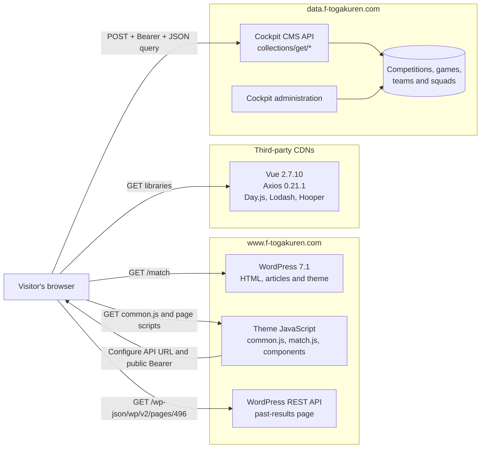
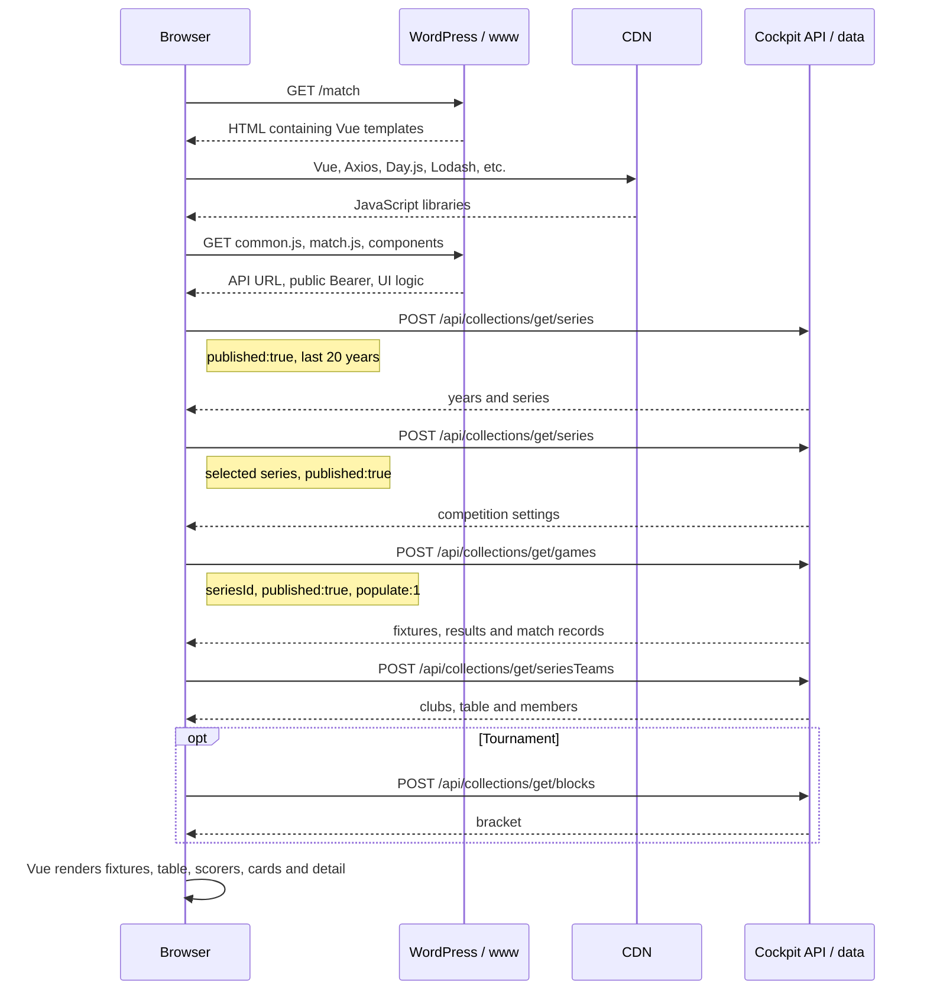
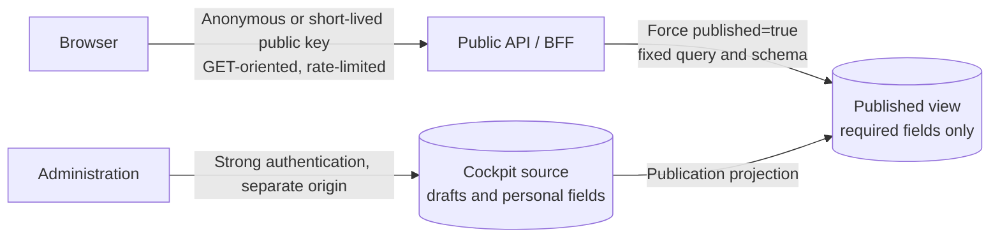

# Official site architecture and public API security assessment

*[日本語](SITE_ARCHITECTURE.ja.md)*

Observed: 10 September 2026 (Japan time)

## Conclusion

**Using an API is not itself a vulnerability or a defect.** A browser receiving
JSON from a server is an ordinary web architecture. Anything needed to render a
public page, including a token embedded in public JavaScript, is observable by
the visitor.

The implementation does, however, have concrete issues separate from the choice
to use an API:

1. An unfiltered `series` request made with the token shipped in public
   JavaScript returned one `published:false` record. Its ID and content were not
   inspected or stored. The public token's permissions or server-side publication
   boundary are too broad.
2. `seriesTeams` returns whole member objects, including fields such as
   `birthday`, `height`, `weight`, `formerTeam`, `nationality`, and `note` that
   are not required by the visible page.
3. The API permits any CORS origin and advertises `PUT` and `DELETE` as allowed
   methods. This does not prove that the public token may write, but it is broader
   than a public read client needs.
4. The API server disclosed `PHP/7.4.2`. Upstream support for PHP 7.4 has ended;
   the actual package and any distribution backports need to be checked.
5. The browser receives Vue 2.7.10, Axios 0.21.1, and Lodash 4.17.20. Vue 2 is
   end-of-life and all three dependencies need a current dependency review.

The short assessment is therefore: **the API architecture is normal, while the
publication boundary and response minimisation have defects or strong defect
indicators; exposure of one unpublished record is confirmed.**

## Architecture

The accurate description is a **Vue 2 match application embedded in a page
served by WordPress**, rather than the whole site being a pure Vue SPA.

`www` and `data` are separate origins. `common.js` configures Axios to send API
requests to `data.f-togakuren.com` with a Bearer token. That value must be treated
as a public-client identifier rather than a secret.

## Page-load traffic

The ranking component makes another `seriesTeams` request and the discipline
component makes another `games` request. The past-results modal alone reads a
page from the same site's WordPress REST API rather than Cockpit.

## Information exchanged

| Source | Main filter | Used by the page | Additional response fields observed |
|---|---|---|---|
| `series` | year, `published:true` | name, short name, type, rules | creator/editor IDs, internal order, descriptive text |
| `games` | `seriesId`, `published:true`, `populate:1` | date, venue, teams, scores, cards, lineups, substitutions, shots | officials, referees, internal metadata, lock state |
| `seriesTeams` | `seriesId` | team, table, name, number, position | birthday, kana, class, height, weight, former team, nationality, notes |
| `blocks` | series ID | tournament bracket | may include internal metadata |
| WordPress REST | fixed page ID 496 | rendered past-results body | public WordPress page representation |

The response is wider than the visible page. Once data reaches the network
response it is public; hiding it in the browser is not an access-control measure.
OWASP recommends returning only legitimate properties and never relying on
client-side filtering of sensitive data.

## Security boundary

### The API itself

The API is not the problem. Both server-rendered HTML and client-rendered JSON
must deliver public information to the visitor. An API can make the boundary
cleaner and separate presentation from content management.

### The Bearer token in JavaScript

Its presence alone is not secret leakage. A fixed browser token is obtainable by
everyone and must be designed as a public value. Safety must come from a
read-only, least-privilege role; server-enforced publication state; an allowlist
of collections and fields; separation from editor credentials; and rate limits,
monitoring, and rotation. Cockpit's own documentation recommends a dedicated
role for public API access.

### Findings

| Priority | Observation | Assessment | Why |
|---|---|---|---|
| High | API banner says `PHP/7.4.2` | Verify and update | PHP 7.4 reached upstream EOL on 28 November 2022. A banner cannot show whether Debian security fixes were backported. |
| Medium | Public token returned one unpublished series | Confirmed publication-boundary failure | The UI's `published:true` filter is not a server-enforced policy. |
| Medium | `seriesTeams` returns unused personal attributes | Excessive data exposure | It lowers the cost of bulk collection and re-identification. |
| Medium | Vue 2.7.10 and old Axios/Lodash | Maintenance and supply-chain risk | Vue 2 is EOL. The observed code alone is not enough to claim immediate exploitability. |
| Low | CORS `*` and all main HTTP methods advertised | Configuration should be narrowed | CORS is not authorisation, and advertising `DELETE` does not prove the token can delete. |
| Low | No CSP, HSTS, nosniff or anti-framing header observed | Missing defence in depth | These headers were absent from the `/match` response observed on 10 September 2026. |
| Low | Exact Apache and PHP versions disclosed | Information exposure | Useful for reconnaissance, but not an intrusion by itself. |

No write, delete, privilege-escalation, or admin-login attempt was made. The
public token's write permissions remain unknown. An `OPTIONS` response listing
`PUT` and `DELETE` must not be reported as proof of write access.

## Recommended target

Recommended order:

1. Audit the role behind the public token. Allow only required
   `collections/get` routes and explicitly deny save, remove, administration,
   and asset-write routes.
2. Enforce `published:true` on the server rather than trusting a client filter.
3. Define fixed public response schemas. In particular, return only the member
   fields required by each public view.
4. Remove the unpublished record from public access, then rotate the public
   token.
5. Upgrade PHP, Cockpit, Vue, Axios, and Lodash to supported versions.
6. Restrict the browser origin and methods to those actually required, without
   treating CORS as authentication or authorisation.
7. Add API rate limits, response-size limits, monitoring, and bulk-enumeration
   alerts.
8. Consider CSP, HSTS, `X-Content-Type-Options: nosniff`, `frame-ancestors` or
   `X-Frame-Options`, and reduced server banners.

## Change in this repository

To respect the same public boundary as the visible site, `Client.series()` now
always sends `published:true` and requests only the series fields needed by the
analysis. Games already used `published:true`. Responses remain cached locally
and requests retain the default 0.5-second spacing.

This does not repair the official API. Another client holding the public token
can still send an unfiltered query, so the root fix must be server-side.

## Method and limits

The assessment read the `/match` HTML and headers, its `common.js`, `match.js`,
five UI component scripts, `robots.txt`, API-root and CORS responses, one minimal
unauthenticated request, the key names from one published series, and only the
counts of `published` values in the unfiltered series response.

The token value, unpublished record ID and contents, and player values were not
stored in this document or repository. No scanner, load test, write/delete
request, privilege escalation, or admin intrusion was attempted. This is a
limited external observation, not a full audit of server configuration and logs.

## References

- [Tokyo University Football Association: fixtures and results](https://www.f-togakuren.com/match)
- [Tokyo University Football Association: privacy policy](https://www.f-togakuren.com/privacy-policy)
- [Cockpit CMS: Authentication](https://getcockpit.com/documentation/core/api/authentication)
- [Cockpit CMS: Configuration](https://getcockpit.com/documentation/core/quickstart/configuration)
- [OWASP: API3:2019 Excessive Data Exposure](https://owasp.org/API-Security/editions/2019/en/0xa3-excessive-data-exposure/)
- [MDN: CORS](https://developer.mozilla.org/en-US/docs/Web/HTTP/Guides/CORS)
- [PHP: Unsupported Branches](https://www.php.net/eol.php)
- [Vue 2 Has Reached End of Life](https://v2.vuejs.org/eol/)
- [Axios security advisories](https://github.com/axios/axios/security/advisories)
- [Lodash changelog](https://github.com/lodash/lodash/wiki/Changelog)
