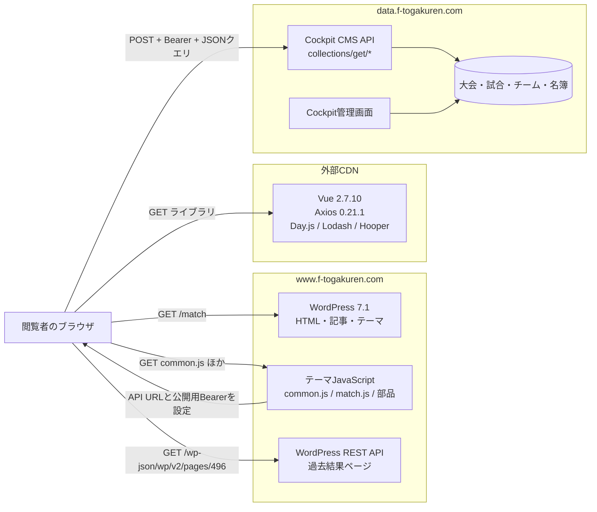
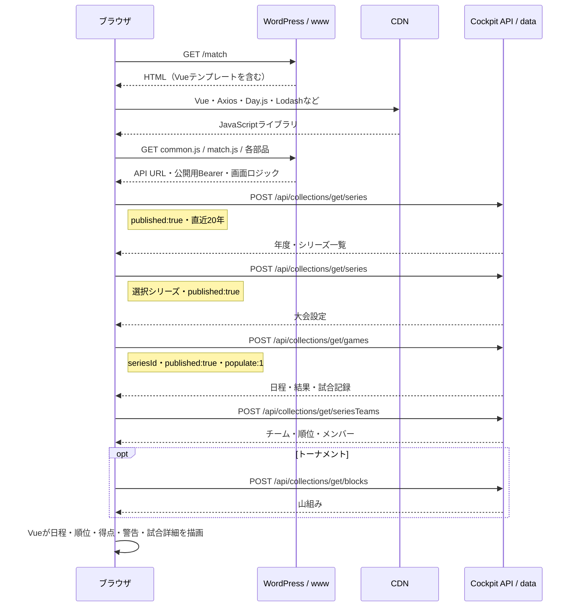
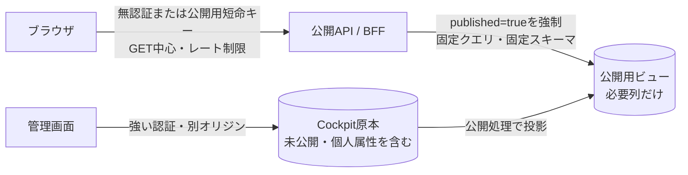

# 公式サイトの構造と公開APIのセキュリティ評価

*[English](SITE_ARCHITECTURE.en.md)*

調査日: 2026-09-10（日本時間）

## 結論

**公式サイトがAPIから情報を読むこと自体は、脆弱性でも欠陥でもありません。** ブラウザで動く画面がサーバーからJSONを受け取る構成は、一般的なWebアーキテクチャです。画面に表示する情報と、その取得に必要な公開用トークンは、利用者のブラウザから必ず観察できます。

ただし、今回の構成にはAPIの存在とは別に、修正を勧める具体的な問題があります。

1. 公開JavaScript内のトークンで無条件に `series` を取得すると、`published:false` のレコードが1件返りました。内容とIDは確認・保存していません。公開トークンの権限またはサーバー側の公開条件が広すぎます。
2. `seriesTeams` は画面で使わない `birthday`、`height`、`weight`、`formerTeam`、`nationality`、`note` なども含むメンバーオブジェクト全体を返します。公開画面に必要な列だけを返すAPIに分けるべきです。
3. APIは任意オリジンにCORSを許可し、`PUT` と `DELETE` も許可メソッドとして案内します。これだけで書き込み可能とは判断できませんが、公開用途としては広すぎる宣言です。
4. APIサーバーは `PHP/7.4.2` を応答ヘッダーに表示しました。PHP 7.4は上流でサポート終了済みです。ディストリビューションによる修正のバックポート状況を含め、実際のパッケージ状態を確認する必要があります。
5. Vue 2.7.10、Axios 0.21.1、Lodash 4.17.20がブラウザへ配信されています。Vue 2はサポート終了済みで、ほかの2つも古いため、利用箇所を含めた依存関係の更新が必要です。

したがって判定は、**「API方式は正常。ただし公開境界の設定と返却データの最小化に欠陥候補があり、少なくとも非公開レコード1件の露出は確認済み」**です。

## 全体アーキテクチャ

公式サイト全体を単純なVueのSPAと呼ぶより、**WordPressが配るページの中にVue 2の試合アプリを埋め込んだ構成**と呼ぶほうが正確です。

`www` と `data` は別のオリジンです。`common.js` がAxiosの送信先を `data.f-togakuren.com` に設定し、すべてのAPIリクエストへBearerトークンを付けます。このトークンは秘密鍵ではなく、公開クライアントを識別するための値として扱う必要があります。

## ページを開いたときの通信

順位表部品は `seriesTeams` を、警告・退場部品は `games` を追加でもう一度取得します。過去結果ポップアップだけはCockpitではなく、同じWordPressのREST APIからページ本文を取得します。

## 通信している情報

| 取得先 | 主な条件 | 画面で使う情報 | レスポンスで確認した追加情報 |
|---|---|---|---|
| `series` | 年度、`published:true` | 大会名、略称、種別、開催要項 | 作成者・更新者ID、内部順序、説明文など |
| `games` | `seriesId`、`published:true`、`populate:1` | 日時、会場、対戦、得点、カード、メンバー、交代、シュート | 運営担当、審判、内部メタデータ、ロック状態など |
| `seriesTeams` | `seriesId` | チーム名、順位、氏名、背番号、ポジション | 生年月日、かな、学年、身長、体重、出身チーム、国籍、注記など |
| `blocks` | 大会ID | トーナメント表 | 内部メタデータを含む可能性があります |
| WordPress REST | 固定ページID 496 | 過去の試合結果本文 | WordPressの公開ページ表現です |

ここで重要なのは、**画面に見える列よりAPIレスポンスのほうが広い**ことです。ブラウザ側で非表示にしても、ネットワーク応答を受け取った時点で公開されています。OWASPも、クライアント側のフィルタリングに頼らず、APIが必要なプロパティだけを返すよう勧めています。

## どこからが脆弱性か

### APIであること

問題ではありません。HTMLへ直接値を書き込む方法でも、JSONを取得して描画する方法でも、公開ページに必要な情報は閲覧者へ渡ります。APIはその境界を明確にし、フロントエンドとデータ管理を分離できます。

### JavaScriptにBearerトークンがあること

それだけでは秘密情報の漏えいではありません。ブラウザで使う固定トークンは誰でも取得できるため、最初から公開値として設計する必要があります。安全性はトークンを隠すことではなく、次の条件で作ります。

- 読み取り専用にします。
- 公開済みレコードだけをサーバー側で強制します。
- 公開専用のコレクションとフィールドだけを許可します。
- 管理者・編集者の権限や個人用APIキーと分離します。
- レート制限、監視、失効・更新手順を用意します。

Cockpit自身も、公開APIに専用ロールを割り当て、権限を絞る構成を案内しています。

### 今回確認できた問題

| 優先度 | 観測 | 判定 | 理由 |
|---|---|---|---|
| 高 | APIの応答バナーが `PHP/7.4.2` | 要確認・更新 | PHP 7.4は2022-11-28に上流サポートが終了しました。バナーだけではDebian側のバックポート有無を判定できません。 |
| 中 | 公開トークンで未公開シリーズ1件を取得可能 | 確認済みの公開境界不備 | 画面の `published:true` は表示側の条件であり、API側の強制ではありません。 |
| 中 | `seriesTeams` が画面で不要な個人属性も返却 | 過剰なデータ露出 | 氏名以外の属性も一括取得しやすく、再識別と大量収集のコストを下げます。 |
| 中 | Vue 2.7.10と古いAxios/Lodash | 保守・供給網リスク | Vue 2はサポート終了済みです。確認した画面コードだけから直ちに悪用可能とは断定しません。 |
| 低 | `Access-Control-Allow-Origin: *`、全主要メソッドを許可 | 設定の整理が必要 | CORSは認可ではなく、サーバー側クライアントを止めません。`DELETE` の宣言は、公開トークンで削除できる証拠ではありません。 |
| 低 | CSP、HSTS、`X-Content-Type-Options`、クリックジャッキング対策を確認できず | 多層防御の不足 | 2026-09-10に取得した `/match` の応答ヘッダーでは確認できませんでした。 |
| 低 | Apache・PHPの詳細版を応答ヘッダーへ表示 | 情報露出 | 攻撃者の探索を少し助けますが、単独では侵入につながりません。 |

書き込み、削除、管理画面への侵入は試していません。したがって、公開トークンに更新権限があるかは未判定です。`OPTIONS` が `PUT` と `DELETE` を列挙した事実だけを、書き込み可能という結論に使ってはいけません。

## 推奨する構成

推奨順は次のとおりです。

1. 公開トークンへ紐づくロールを確認し、`collections/get` の必要なコレクションだけに制限します。`save`、`remove`、管理API、アセット書き込みを明示的に拒否します。
2. API側で `published:true` を強制します。フロントエンドが送るフィルターを信用しません。
3. 公開用レスポンスを固定スキーマにします。特に `seriesTeams.members` は、画面ごとに氏名・背番号・ポジションなど必要な列だけを返します。
4. 未公開レコードが1件返る原因を調べ、公開APIから切り離した後に公開トークンを更新します。
5. APIサーバーのPHPとCockpit、Vue、Axios、Lodashをサポート対象版へ更新します。
6. オリジンを `https://www.f-togakuren.com` に限定し、許可メソッドを実際に必要なものへ絞ります。ただし、CORSを認証・認可の代わりにはしません。
7. APIへレート制限、応答サイズ上限、監視を追加し、列挙と大量取得を検知します。
8. CSP、HSTS、`X-Content-Type-Options: nosniff`、`frame-ancestors` または `X-Frame-Options` を検討し、サーバーバナーを最小化します。

## このリポジトリでの対応

`togakuren-analytics` は、公式画面と同じ公開境界を守るため `Client.series()` に `published:true` を常時付けました。また、大会一覧は解析に必要なフィールドだけを要求します。試合は以前から `published:true` を付けています。取得結果はローカルへキャッシュし、既定でリクエスト間隔を0.5秒空けます。

これは公式API側の公開境界不備を直すものではありません。公開トークンを持つ別のクライアントは依然として無条件クエリを送れるため、根本対策はサーバー側で必要です。

## 調査方法と限界

次を読み取り専用で確認しました。

- `https://www.f-togakuren.com/match` のHTMLと応答ヘッダー
- ページが読み込む `common.js`、`match.js`、5つの表示部品
- `robots.txt`
- APIルート、CORSプリフライト、認証なしの最小APIリクエスト
- サイト自身が配るトークンを用いた、公開済みシリーズ1件のキー名だけの確認
- 無条件の大会一覧に含まれる `published` 値の件数だけの確認

トークン値、未公開レコードのID・内容、選手の値は文書にもリポジトリにも保存していません。脆弱性スキャナー、負荷試験、権限昇格、書き込み・削除APIの試行は行っていません。この文書は限定的な外部観測であり、サーバー設定と監査ログを含む完全なセキュリティ監査ではありません。

## 参照資料

- [東京都大学サッカー連盟 試合日程・結果](https://www.f-togakuren.com/match)
- [東京都大学サッカー連盟 プライバシーポリシー](https://www.f-togakuren.com/privacy-policy)
- [Cockpit CMS: Authentication](https://getcockpit.com/documentation/core/api/authentication)
- [Cockpit CMS: Configuration](https://getcockpit.com/documentation/core/quickstart/configuration)
- [OWASP: API3:2019 Excessive Data Exposure](https://owasp.org/API-Security/editions/2019/en/0xa3-excessive-data-exposure/)
- [MDN: CORS](https://developer.mozilla.org/en-US/docs/Web/HTTP/Guides/CORS)
- [PHP: Unsupported Branches](https://www.php.net/eol.php)
- [Vue 2 Has Reached End of Life](https://v2.vuejs.org/eol/)
- [Axios security advisories](https://github.com/axios/axios/security/advisories)
- [Lodash changelog](https://github.com/lodash/lodash/wiki/Changelog)
