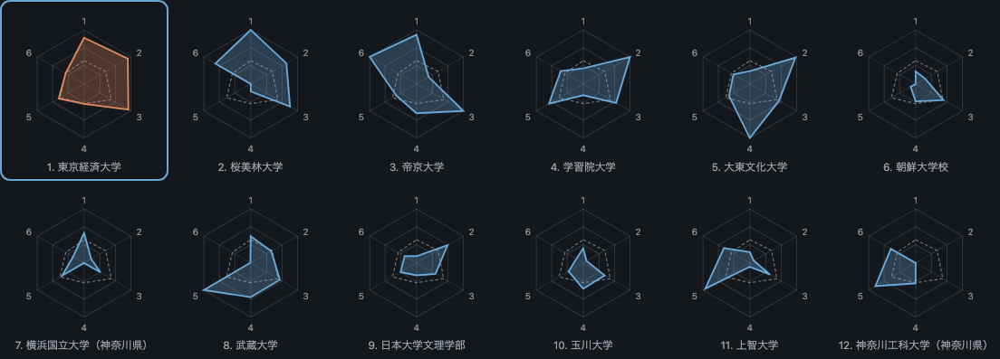

# Team profiles — 2023 年度 第 1 回 関東大学サッカーリーグ戦 東京・神奈川　チャレンジ

Every club in the division, from the federation's published match records. Aggregates only — no individual appears in this document; see [../DATA_POLICY.md](../DATA_POLICY.md).

Snapshot of 2023 チャレンジリーグ, generated 2026-08-29. Regenerate with `togakuren profiles --series "2023 チャレンジリーグ"`.

## League table

| # | Team | P | Pts | W-D-L | GF | GA | GD | Shots | S/game | Conv |
| --- | --- | --: | --: | --: | --: | --: | --: | --: | --: | --: |
| 1 | 桜美林大学 | 13 | 39 | 13-0-0 | 84 | 11 | 73 | 337 | 25.9 | 0.249 |
| 2 | 創価大学 | 13 | 32 | 10-2-1 | 52 | 10 | 42 | 215 | 16.5 | 0.242 |
| 3 | 山梨大学 | 13 | 24 | 7-3-3 | 37 | 24 | 13 | 190 | 14.6 | 0.195 |
| 4 | 日本文化大學 | 13 | 23 | 7-2-4 | 47 | 31 | 16 | 157 | 12.1 | 0.299 |
| 5 | 武蔵野大学 | 13 | 22 | 6-4-3 | 36 | 17 | 19 | 181 | 13.9 | 0.199 |
| 6 | 横浜商科大学（神奈川県） | 13 | 22 | 7-1-5 | 32 | 30 | 2 | 120 | 9.2 | 0.267 |
| 7 | 東京農工大学 | 13 | 20 | 6-2-5 | 25 | 27 | -2 | 119 | 9.2 | 0.210 |
| 8 | 横浜市立大学（神奈川県） | 13 | 18 | 6-0-7 | 26 | 26 | 0 | 133 | 10.2 | 0.195 |
| 9 | 電気通信大学 | 13 | 17 | 5-2-6 | 17 | 25 | -8 | 114 | 8.8 | 0.149 |
| 10 | 東京外国語大学 | 13 | 14 | 4-2-7 | 16 | 30 | -14 | 86 | 6.6 | 0.186 |
| 11 | 東京都市大学 | 13 | 13 | 3-4-6 | 14 | 22 | -8 | 100 | 7.7 | 0.140 |
| 12 | 明星大学 | 13 | 12 | 4-0-9 | 21 | 38 | -17 | 104 | 8.0 | 0.202 |
| 13 | 北里大学 | 13 | 3 | 0-3-10 | 13 | 80 | -67 | 76 | 5.8 | 0.171 |
| 14 | 東京薬科大学 | 13 | 1 | 0-1-12 | 4 | 53 | -49 | 47 | 3.6 | 0.085 |

## Fingerprints

Six indices, each scaled within this division. The chart is the same one the dashboard draws; the numbers under each club repeat it in text.

### 1. 桜美林大学

13 played · 39 points · 84 scored, 11 conceded · 25.9 shots per game at 0.249 · 33 players used, top eleven took 61% of the minutes · mean year 1.88

**Indices** — Shot volume 100 / Finishing 77 / Defence 99 / Rotation 100 / Underclassmen 84 / Second-half weight 100

37 against the top half, 47 against the bottom half (56% from below).

**By academic year**

| Year | Players | Minutes | Goals |
| --- | --: | --: | --: |
| 1 | 19 | 6737 | 43 |
| 2 | 4 | 1070 | 3 |
| 3 | 3 | 882 | 2 |
| 4 | 4 | 2691 | 32 |

**Season history**

| Season | Division | P | W-D-L | Pts | Pts/game | GF | GD |
| --- | --- | --: | --: | --: | --: | --: | --: |
| 2021 | 2部リーグ | 18 | 3-2-13 | 11 | 0.61 | 22 | -42 |
| 2022 | チャレンジリーグ | 15 | 10-3-2 | 33 | 2.2 | 75 | 51 |
| 2023 | チャレンジリーグ | 13 | 13-0-0 | 39 | 3.0 | 84 | 73 |
| 2024 | 2部リーグ | 18 | 14-2-2 | 44 | 2.44 | 60 | 51 |
| 2025 | 1部リーグ | 22 | 13-3-6 | 42 | 1.91 | 44 | 17 |
| 2026 | 1部リーグ | 13 | 9-4-0 | 31 | 2.38 | 42 | 30 |

### 2. 創価大学

13 played · 32 points · 52 scored, 10 conceded · 16.5 shots per game at 0.242 · 20 players used, top eleven took 78% of the minutes · mean year 2.55

**Indices** — Shot volume 58 / Finishing 73 / Defence 100 / Rotation 15 / Underclassmen 38 / Second-half weight 56

18 against the top half, 34 against the bottom half (65% from below).

**By academic year**

| Year | Players | Minutes | Goals |
| --- | --: | --: | --: |
| 1 | 4 | 2193 | 13 |
| 2 | 5 | 4074 | 3 |
| 3 | 7 | 3881 | 19 |
| 4 | 4 | 2722 | 16 |

**Season history**

| Season | Division | P | W-D-L | Pts | Pts/game | GF | GD |
| --- | --- | --: | --: | --: | --: | --: | --: |
| 2021 | 2部リーグ | 18 | 4-8-6 | 20 | 1.11 | 23 | -7 |
| 2022 | チャレンジリーグ | 15 | 11-1-3 | 34 | 2.27 | 52 | 33 |
| 2023 | チャレンジリーグ | 13 | 10-2-1 | 32 | 2.46 | 52 | 42 |
| 2024 | 2部リーグ | 18 | 10-2-6 | 32 | 1.78 | 36 | 15 |
| 2025 | 2部リーグ | 18 | 8-4-6 | 28 | 1.56 | 25 | 2 |
| 2026 | 2部リーグ | 12 | 2-5-5 | 11 | 0.92 | 11 | -9 |

### 3. 山梨大学

13 played · 24 points · 37 scored, 24 conceded · 14.6 shots per game at 0.195 · 24 players used, top eleven took 76% of the minutes · mean year 2.38

**Indices** — Shot volume 49 / Finishing 51 / Defence 80 / Rotation 25 / Underclassmen 68 / Second-half weight 12

14 against the top half, 23 against the bottom half (62% from below).

**By academic year**

| Year | Players | Minutes | Goals |
| --- | --: | --: | --: |
| 1 | 4 | 2169 | 9 |
| 2 | 12 | 5498 | 11 |
| 3 | 4 | 3277 | 10 |
| 4 | 4 | 1851 | 7 |

**Season history**

| Season | Division | P | W-D-L | Pts | Pts/game | GF | GD |
| --- | --- | --: | --: | --: | --: | --: | --: |
| 2021 | 3部リーグ | 8 | 6-0-2 | 18 | 2.25 | 22 | 8 |
| 2022 | チャレンジリーグ | 15 | 10-1-4 | 31 | 2.07 | 38 | 20 |
| 2023 | チャレンジリーグ | 13 | 7-3-3 | 24 | 1.85 | 37 | 13 |
| 2024 | チャレンジリーグ | 14 | 10-1-3 | 31 | 2.21 | 37 | 17 |

### 4. 日本文化大學

13 played · 23 points · 47 scored, 31 conceded · 12.1 shots per game at 0.299 · 24 players used, top eleven took 74% of the minutes · mean year 2.24

**Indices** — Shot volume 38 / Finishing 100 / Defence 70 / Rotation 34 / Underclassmen 77 / Second-half weight 37

13 against the top half, 34 against the bottom half (72% from below).

**By academic year**

| Year | Players | Minutes | Goals |
| --- | --: | --: | --: |
| 1 | 10 | 4581 | 15 |
| 2 | 7 | 2852 | 15 |
| 3 | 3 | 1245 | 0 |
| 4 | 4 | 3082 | 11 |

**Season history**

| Season | Division | P | W-D-L | Pts | Pts/game | GF | GD |
| --- | --- | --: | --: | --: | --: | --: | --: |
| 2021 | 4部リーグ | 5 | 5-0-0 | 15 | 3.0 | 18 | 13 |
| 2022 | チャレンジリーグ | 15 | 7-1-7 | 22 | 1.47 | 41 | 3 |
| 2023 | チャレンジリーグ | 13 | 7-2-4 | 23 | 1.77 | 47 | 16 |
| 2024 | 2部リーグ | 18 | 4-4-10 | 16 | 0.89 | 28 | -14 |
| 2025 | 3部リーグ | 16 | 14-0-2 | 42 | 2.62 | 61 | 50 |
| 2026 | 2部リーグ | 12 | 9-1-2 | 28 | 2.33 | 25 | 16 |

### 5. 武蔵野大学

13 played · 22 points · 36 scored, 17 conceded · 13.9 shots per game at 0.199 · 28 players used, top eleven took 70% of the minutes · mean year 2.30

**Indices** — Shot volume 46 / Finishing 53 / Defence 90 / Rotation 55 / Underclassmen 35 / Second-half weight 29

7 against the top half, 29 against the bottom half (81% from below).

**By academic year**

| Year | Players | Minutes | Goals |
| --- | --: | --: | --: |
| 1 | 11 | 4167 | 11 |
| 2 | 6 | 1956 | 11 |
| 3 | 7 | 5465 | 11 |
| 4 | 4 | 1271 | 3 |

**Season history**

| Season | Division | P | W-D-L | Pts | Pts/game | GF | GD |
| --- | --- | --: | --: | --: | --: | --: | --: |
| 2023 | チャレンジリーグ | 13 | 6-4-3 | 22 | 1.69 | 36 | 19 |
| 2024 | 2部リーグ | 18 | 4-2-12 | 14 | 0.78 | 24 | -20 |
| 2025 | 3部リーグ | 16 | 9-2-5 | 29 | 1.81 | 42 | 16 |
| 2026 | 3部リーグ | 9 | 6-2-1 | 20 | 2.22 | 17 | 9 |

### 6. 横浜商科大学（神奈川県）

13 played · 22 points · 32 scored, 30 conceded · 9.2 shots per game at 0.267 · 24 players used, top eleven took 74% of the minutes · mean year 2.25

**Indices** — Shot volume 25 / Finishing 85 / Defence 71 / Rotation 37 / Underclassmen 75 / Second-half weight 42

11 against the top half, 21 against the bottom half (66% from below).

**By academic year**

| Year | Players | Minutes | Goals |
| --- | --: | --: | --: |
| 1 | 5 | 3347 | 3 |
| 2 | 8 | 4699 | 17 |
| 3 | 6 | 3035 | 4 |
| 4 | 5 | 1789 | 6 |

**Season history**

| Season | Division | P | W-D-L | Pts | Pts/game | GF | GD |
| --- | --- | --: | --: | --: | --: | --: | --: |
| 2023 | チャレンジリーグ | 13 | 7-1-5 | 22 | 1.69 | 32 | 2 |
| 2024 | 2部リーグ | 18 | 3-4-11 | 13 | 0.72 | 21 | -28 |

### 7. 東京農工大学

13 played · 20 points · 25 scored, 27 conceded · 9.2 shots per game at 0.210 · 20 players used, top eleven took 80% of the minutes · mean year 2.50

**Indices** — Shot volume 25 / Finishing 58 / Defence 76 / Rotation 5 / Underclassmen 13 / Second-half weight 19

3 against the top half, 22 against the bottom half (88% from below).

**By academic year**

| Year | Players | Minutes | Goals |
| --- | --: | --: | --: |
| 1 | 3 | 1244 | 3 |
| 2 | 7 | 3473 | 5 |
| 3 | 10 | 7163 | 14 |
| 4 | 0 | 0 | 0 |

**Season history**

| Season | Division | P | W-D-L | Pts | Pts/game | GF | GD |
| --- | --- | --: | --: | --: | --: | --: | --: |
| 2021 | 4部リーグ | 7 | 6-0-1 | 18 | 2.57 | 17 | 15 |
| 2022 | チャレンジリーグ | 15 | 7-1-7 | 22 | 1.47 | 44 | 3 |
| 2023 | チャレンジリーグ | 13 | 6-2-5 | 20 | 1.54 | 25 | -2 |
| 2024 | チャレンジリーグ | 15 | 10-2-3 | 32 | 2.13 | 23 | 9 |
| 2025 | 3部リーグ | 16 | 0-4-12 | 4 | 0.25 | 12 | -49 |
| 2026 | 3部リーグ | 8 | 2-1-5 | 7 | 0.88 | 10 | -17 |

### 8. 横浜市立大学（神奈川県）

13 played · 18 points · 26 scored, 26 conceded · 10.2 shots per game at 0.195 · 19 players used, top eleven took 80% of the minutes · mean year 1.74

**Indices** — Shot volume 30 / Finishing 52 / Defence 77 / Rotation 8 / Underclassmen 95 / Second-half weight 62

10 against the top half, 16 against the bottom half (62% from below).

**By academic year**

| Year | Players | Minutes | Goals |
| --- | --: | --: | --: |
| 1 | 11 | 7247 | 19 |
| 2 | 3 | 1758 | 3 |
| 3 | 5 | 3865 | 4 |
| 4 | 0 | 0 | 0 |

**Season history**

| Season | Division | P | W-D-L | Pts | Pts/game | GF | GD |
| --- | --- | --: | --: | --: | --: | --: | --: |
| 2023 | チャレンジリーグ | 13 | 6-0-7 | 18 | 1.38 | 26 | 0 |
| 2024 | 2部リーグ | 18 | 4-2-12 | 14 | 0.78 | 18 | -22 |
| 2025 | 3部リーグ | 16 | 10-1-5 | 31 | 1.94 | 35 | 13 |
| 2026 | 3部リーグ | 8 | 4-3-1 | 15 | 1.88 | 31 | 18 |

### 9. 電気通信大学

13 played · 17 points · 17 scored, 25 conceded · 8.8 shots per game at 0.149 · 22 players used, top eleven took 81% of the minutes · mean year 2.34

**Indices** — Shot volume 23 / Finishing 30 / Defence 79 / Rotation 0 / Underclassmen 24 / Second-half weight 0

7 against the top half, 10 against the bottom half (59% from below).

**By academic year**

| Year | Players | Minutes | Goals |
| --- | --: | --: | --: |
| 1 | 9 | 2874 | 3 |
| 2 | 5 | 2716 | 6 |
| 3 | 8 | 7264 | 8 |
| 4 | 0 | 0 | 0 |

**Season history**

| Season | Division | P | W-D-L | Pts | Pts/game | GF | GD |
| --- | --- | --: | --: | --: | --: | --: | --: |
| 2021 | 3部リーグ | 9 | 2-2-5 | 8 | 0.89 | 21 | -6 |
| 2022 | チャレンジリーグ | 15 | 4-0-11 | 12 | 0.8 | 34 | -13 |
| 2023 | チャレンジリーグ | 13 | 5-2-6 | 17 | 1.31 | 17 | -8 |
| 2024 | チャレンジリーグ | 15 | 5-3-7 | 18 | 1.2 | 22 | 1 |
| 2025 | 3部リーグ | 16 | 2-2-12 | 8 | 0.5 | 11 | -39 |
| 2026 | 3部リーグ | 9 | 2-3-4 | 9 | 1.0 | 12 | -5 |

### 10. 東京外国語大学

13 played · 14 points · 16 scored, 30 conceded · 6.6 shots per game at 0.186 · 22 players used, top eleven took 74% of the minutes · mean year 2.19

**Indices** — Shot volume 13 / Finishing 47 / Defence 71 / Rotation 33 / Underclassmen 69 / Second-half weight 74

8 against the top half, 8 against the bottom half (50% from below).

**By academic year**

| Year | Players | Minutes | Goals |
| --- | --: | --: | --: |
| 1 | 5 | 3111 | 4 |
| 2 | 8 | 3992 | 2 |
| 3 | 7 | 3976 | 3 |
| 4 | 2 | 711 | 2 |

**Season history**

| Season | Division | P | W-D-L | Pts | Pts/game | GF | GD |
| --- | --- | --: | --: | --: | --: | --: | --: |
| 2021 | 3部リーグ | 9 | 4-0-5 | 12 | 1.33 | 17 | -11 |
| 2022 | チャレンジリーグ | 15 | 6-4-5 | 22 | 1.47 | 37 | 6 |
| 2023 | チャレンジリーグ | 13 | 4-2-7 | 14 | 1.08 | 16 | -14 |
| 2024 | 2部リーグ | 17 | 1-0-16 | 3 | 0.18 | 15 | -53 |
| 2025 | 3部リーグ | 16 | 7-1-8 | 22 | 1.38 | 33 | -2 |
| 2026 | 3部リーグ | 9 | 4-2-3 | 14 | 1.56 | 27 | 13 |

### 11. 東京都市大学

13 played · 13 points · 14 scored, 22 conceded · 7.7 shots per game at 0.140 · 33 players used, top eleven took 65% of the minutes · mean year 2.23

**Indices** — Shot volume 18 / Finishing 26 / Defence 83 / Rotation 77 / Underclassmen 56 / Second-half weight 88

5 against the top half, 9 against the bottom half (64% from below).

**By academic year**

| Year | Players | Minutes | Goals |
| --- | --: | --: | --: |
| 1 | 10 | 2779 | 2 |
| 2 | 11 | 4375 | 5 |
| 3 | 12 | 5716 | 7 |
| 4 | 0 | 0 | 0 |

**Season history**

| Season | Division | P | W-D-L | Pts | Pts/game | GF | GD |
| --- | --- | --: | --: | --: | --: | --: | --: |
| 2021 | 3部リーグ | 9 | 4-1-4 | 13 | 1.44 | 20 | -9 |
| 2022 | チャレンジリーグ | 14 | 5-2-7 | 17 | 1.21 | 24 | -3 |
| 2023 | チャレンジリーグ | 13 | 3-4-6 | 13 | 1.0 | 14 | -8 |
| 2024 | チャレンジリーグ | 16 | 10-2-4 | 32 | 2.0 | 43 | 16 |
| 2025 | チャレンジリーグ | 10 | 9-0-1 | 27 | 2.7 | 29 | 18 |
| 2026 | 3部リーグ | 9 | 4-1-4 | 13 | 1.44 | 12 | -10 |

### 12. 明星大学

13 played · 12 points · 21 scored, 38 conceded · 8.0 shots per game at 0.202 · 24 players used, top eleven took 70% of the minutes · mean year 2.21

**Indices** — Shot volume 20 / Finishing 54 / Defence 60 / Rotation 56 / Underclassmen 100 / Second-half weight 35

9 against the top half, 12 against the bottom half (57% from below).

**By academic year**

| Year | Players | Minutes | Goals |
| --- | --: | --: | --: |
| 1 | 6 | 2470 | 3 |
| 2 | 11 | 6060 | 8 |
| 3 | 3 | 1728 | 3 |
| 4 | 4 | 1622 | 4 |

**Season history**

| Season | Division | P | W-D-L | Pts | Pts/game | GF | GD |
| --- | --- | --: | --: | --: | --: | --: | --: |
| 2021 | 4部リーグ | 7 | 5-0-2 | 15 | 2.14 | 21 | 14 |
| 2022 | チャレンジリーグ | 15 | 5-0-10 | 15 | 1.0 | 22 | -24 |
| 2023 | チャレンジリーグ | 13 | 4-0-9 | 12 | 0.92 | 21 | -17 |
| 2024 | チャレンジリーグ | 14 | 5-1-8 | 16 | 1.14 | 11 | -15 |
| 2025 | チャレンジリーグ | 10 | 0-1-9 | 1 | 0.1 | 11 | -27 |

### 13. 北里大学

13 played · 3 points · 13 scored, 80 conceded · 5.8 shots per game at 0.171 · 28 players used, top eleven took 67% of the minutes · mean year 2.02

**Indices** — Shot volume 10 / Finishing 40 / Defence 0 / Rotation 68 / Underclassmen 77 / Second-half weight 39

7 against the top half, 6 against the bottom half (46% from below).

**By academic year**

| Year | Players | Minutes | Goals |
| --- | --: | --: | --: |
| 1 | 10 | 4427 | 5 |
| 2 | 9 | 3079 | 2 |
| 3 | 7 | 4060 | 5 |
| 4 | 2 | 314 | 0 |

**Season history**

| Season | Division | P | W-D-L | Pts | Pts/game | GF | GD |
| --- | --- | --: | --: | --: | --: | --: | --: |
| 2021 | 4部リーグ | 4 | 1-0-3 | 3 | 0.75 | 2 | -6 |
| 2022 | チャレンジリーグ | 15 | 4-0-11 | 12 | 0.8 | 18 | -44 |
| 2023 | チャレンジリーグ | 13 | 0-3-10 | 3 | 0.23 | 13 | -67 |
| 2024 | チャレンジリーグ | 13 | 1-0-12 | 3 | 0.23 | 15 | -38 |
| 2025 | チャレンジリーグ | 10 | 2-0-8 | 6 | 0.6 | 8 | -29 |
| 2026 | 3部リーグ | 8 | 0-0-8 | 0 | 0.0 | 7 | -20 |

### 14. 東京薬科大学

13 played · 1 points · 4 scored, 53 conceded · 3.6 shots per game at 0.085 · 17 players used, top eleven took 81% of the minutes · mean year 2.65

**Indices** — Shot volume 0 / Finishing 0 / Defence 39 / Rotation 2 / Underclassmen 0 / Second-half weight 53

1 against the top half, 3 against the bottom half (75% from below).

**By academic year**

| Year | Players | Minutes | Goals |
| --- | --: | --: | --: |
| 1 | 0 | 0 | 0 |
| 2 | 6 | 3094 | 3 |
| 3 | 11 | 5816 | 1 |
| 4 | 0 | 0 | 0 |

**Season history**

| Season | Division | P | W-D-L | Pts | Pts/game | GF | GD |
| --- | --- | --: | --: | --: | --: | --: | --: |
| 2021 | 4部リーグ | 4 | 1-0-3 | 3 | 0.75 | 3 | -6 |
| 2022 | チャレンジリーグ | 14 | 4-0-10 | 12 | 0.86 | 18 | -19 |
| 2023 | チャレンジリーグ | 13 | 0-1-12 | 1 | 0.08 | 4 | -49 |
| 2024 | チャレンジリーグ | 15 | 2-1-12 | 7 | 0.47 | 18 | -27 |
| 2025 | チャレンジリーグ | 10 | 3-2-5 | 11 | 1.1 | 19 | -7 |
| 2026 | 3部リーグ | 8 | 0-0-8 | 0 | 0.0 | 4 | -51 |

---

*Followed by federation club id, so a division change is a real move.*
