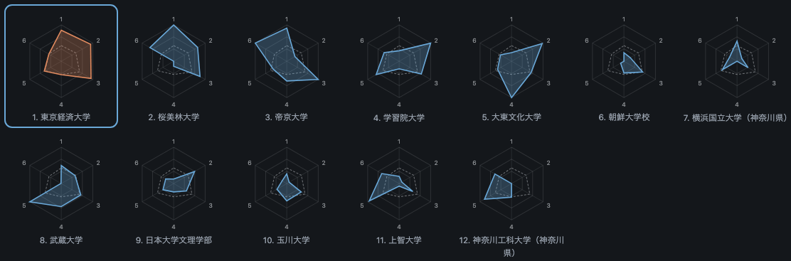

# チーム分析 — 2025 年度 第 3 回 関東大学サッカーリーグ戦 東京・神奈川 チャレンジリーグ

*[English](2025-challenge.en.md)*

連盟が公開している試合記録をもとに、その部の全チームを集計した文書。選手個人の情報は掲載していません（[../DATA_POLICY.ja.md](../DATA_POLICY.ja.md)）。

2025 チャレンジリーグ。シーズンは終了しているため、この文書は確定です。同じ記録に同じ処理をかければそのまま再現されます。再生成は `togakuren profiles --series "2025 チャレンジリーグ" --lang ja`。

## 順位表

| 順位 | チーム | 試合 | 勝点 | 勝-分-敗 | 得点 | 失点 | 得失点 | シュート | 1試合平均 | 決定率 |
| --- | --- | --: | --: | --: | --: | --: | --: | --: | --: | --: |
| 1 | 東京都市大学 | 10 | 27 | 9-0-1 | 29 | 11 | 18 | 149 | 14.9 | 0.195 |
| 2 | 松蔭大学・横浜商科大学 | 10 | 25 | 8-1-1 | 34 | 8 | 26 | 167 | 16.7 | 0.204 |
| 3 | 和光大学 | 10 | 17 | 5-2-3 | 38 | 19 | 19 | 182 | 18.2 | 0.209 |
| 4 | 東京薬科大学 | 10 | 11 | 3-2-5 | 19 | 26 | -7 | 129 | 12.9 | 0.147 |
| 5 | 北里大学 | 10 | 6 | 2-0-8 | 8 | 37 | -29 | 65 | 6.5 | 0.123 |
| 6 | 明星大学 | 10 | 1 | 0-1-9 | 11 | 38 | -27 | 52 | 5.2 | 0.212 |

## チームの特徴

6指標をこの部の中で相対化した値。頂点の番号1〜6は上から時計回りで、各クラブの項目に並ぶ指標と同じ順序。点線はこの部の平均。図はダッシュボードと共通で、各クラブの項目にも同じ数値を記載しています。

### 1. 東京都市大学

10試合 / 勝点27 / 29得点11失点 / シュートは1試合平均14.9本、決定率0.195 / 30人を起用し、主力11人が出場時間の73%を占める / 平均学年2.29

**指標** — シュート数 75 / 決定率 81 / 守備 90 / ターンオーバー 65 / 下級生比率 20 / 後半の比重 9

上位陣から10点、下位陣から19点（下位陣からの得点が66%）。

**学年別**

| 学年 | 人数 | 出場時間(分) | 得点 |
| --- | --: | --: | --: |
| 1 | 12 | 2612 | 5 |
| 2 | 5 | 1817 | 2 |
| 3 | 13 | 5471 | 22 |
| 4 | 0 | 0 | 0 |

**過去シーズン**

| 年度 | 部 | 試合 | 勝-分-敗 | 勝点 | 1試合平均 | 得点 | 得失 |
| --- | --- | --: | --: | --: | --: | --: | --: |
| 2021 | 3部リーグ | 9 | 4-1-4 | 13 | 1.44 | 20 | -9 |
| 2022 | チャレンジリーグ | 14 | 5-2-7 | 17 | 1.21 | 24 | -3 |
| 2023 | チャレンジリーグ | 13 | 3-4-6 | 13 | 1.0 | 14 | -8 |
| 2024 | チャレンジリーグ | 16 | 10-2-4 | 32 | 2.0 | 43 | 16 |
| 2025 | チャレンジリーグ | 10 | 9-0-1 | 27 | 2.7 | 29 | 18 |
| 2026 | 3部リーグ | 9 | 4-1-4 | 13 | 1.44 | 12 | -10 |

### 2. 松蔭大学・横浜商科大学

10試合 / 勝点25 / 34得点8失点 / シュートは1試合平均16.7本、決定率0.204 / 21人を起用し、主力11人が出場時間の77%を占める / 平均学年2.34

**指標** — シュート数 88 / 決定率 91 / 守備 100 / ターンオーバー 50 / 下級生比率 38 / 後半の比重 100

上位陣から7点、下位陣から27点（下位陣からの得点が79%）。

**学年別**

| 学年 | 人数 | 出場時間(分) | 得点 |
| --- | --: | --: | --: |
| 1 | 5 | 2131 | 2 |
| 2 | 5 | 3386 | 16 |
| 3 | 8 | 3233 | 14 |
| 4 | 3 | 1150 | 2 |

**過去シーズン**

| 年度 | 部 | 試合 | 勝-分-敗 | 勝点 | 1試合平均 | 得点 | 得失 |
| --- | --- | --: | --: | --: | --: | --: | --: |
| 2025 | チャレンジリーグ | 10 | 8-1-1 | 25 | 2.5 | 34 | 26 |
| 2026 | 3部リーグ | 8 | 3-1-4 | 10 | 1.25 | 18 | 0 |

### 3. 和光大学

10試合 / 勝点17 / 38得点19失点 / シュートは1試合平均18.2本、決定率0.209 / 24人を起用し、主力11人が出場時間の78%を占める / 平均学年1.41

**指標** — シュート数 100 / 決定率 97 / 守備 63 / ターンオーバー 46 / 下級生比率 49 / 後半の比重 41

上位陣から6点、下位陣から32点（下位陣からの得点が84%）。

**学年別**

| 学年 | 人数 | 出場時間(分) | 得点 |
| --- | --: | --: | --: |
| 1 | 9 | 2826 | 7 |
| 2 | 7 | 3397 | 26 |
| 3 | 3 | 1446 | 0 |
| 4 | 0 | 0 | 0 |

**過去シーズン**

| 年度 | 部 | 試合 | 勝-分-敗 | 勝点 | 1試合平均 | 得点 | 得失 |
| --- | --- | --: | --: | --: | --: | --: | --: |
| 2024 | チャレンジリーグ | 16 | 8-2-6 | 26 | 1.62 | 45 | 24 |
| 2025 | チャレンジリーグ | 10 | 5-2-3 | 17 | 1.7 | 38 | 19 |
| 2026 | 3部リーグ | 9 | 1-0-8 | 3 | 0.33 | 6 | -45 |

### 4. 東京薬科大学

10試合 / 勝点11 / 19得点26失点 / シュートは1試合平均12.9本、決定率0.147 / 27人を起用し、主力11人が出場時間の72%を占める / 平均学年2.35

**指標** — シュート数 59 / 決定率 27 / 守備 40 / ターンオーバー 68 / 下級生比率 0 / 後半の比重 3

上位陣から6点、下位陣から13点（下位陣からの得点が68%）。

**学年別**

| 学年 | 人数 | 出場時間(分) | 得点 |
| --- | --: | --: | --: |
| 1 | 4 | 724 | 1 |
| 2 | 6 | 2477 | 1 |
| 3 | 12 | 5858 | 15 |
| 4 | 0 | 0 | 0 |

**過去シーズン**

| 年度 | 部 | 試合 | 勝-分-敗 | 勝点 | 1試合平均 | 得点 | 得失 |
| --- | --- | --: | --: | --: | --: | --: | --: |
| 2021 | 4部リーグ | 4 | 1-0-3 | 3 | 0.75 | 3 | -6 |
| 2022 | チャレンジリーグ | 14 | 4-0-10 | 12 | 0.86 | 18 | -19 |
| 2023 | チャレンジリーグ | 13 | 0-1-12 | 1 | 0.08 | 4 | -49 |
| 2024 | チャレンジリーグ | 15 | 2-1-12 | 7 | 0.47 | 18 | -27 |
| 2025 | チャレンジリーグ | 10 | 3-2-5 | 11 | 1.1 | 19 | -7 |
| 2026 | 3部リーグ | 8 | 0-0-8 | 0 | 0.0 | 4 | -51 |

### 5. 北里大学

10試合 / 勝点6 / 8得点37失点 / シュートは1試合平均6.5本、決定率0.123 / 28人を起用し、主力11人が出場時間の65%を占める / 平均学年1.41

**指標** — シュート数 10 / 決定率 0 / 守備 3 / ターンオーバー 100 / 下級生比率 100 / 後半の比重 22

上位陣から2点、下位陣から6点（下位陣からの得点が75%）。

**学年別**

| 学年 | 人数 | 出場時間(分) | 得点 |
| --- | --: | --: | --: |
| 1 | 18 | 6787 | 6 |
| 2 | 7 | 2317 | 0 |
| 3 | 1 | 45 | 0 |
| 4 | 2 | 527 | 2 |

**過去シーズン**

| 年度 | 部 | 試合 | 勝-分-敗 | 勝点 | 1試合平均 | 得点 | 得失 |
| --- | --- | --: | --: | --: | --: | --: | --: |
| 2021 | 4部リーグ | 4 | 1-0-3 | 3 | 0.75 | 2 | -6 |
| 2022 | チャレンジリーグ | 15 | 4-0-11 | 12 | 0.8 | 18 | -44 |
| 2023 | チャレンジリーグ | 13 | 0-3-10 | 3 | 0.23 | 13 | -67 |
| 2024 | チャレンジリーグ | 13 | 1-0-12 | 3 | 0.23 | 15 | -38 |
| 2025 | チャレンジリーグ | 10 | 2-0-8 | 6 | 0.6 | 8 | -29 |
| 2026 | 3部リーグ | 8 | 0-0-8 | 0 | 0.0 | 7 | -20 |

### 6. 明星大学

10試合 / 勝点1 / 11得点38失点 / シュートは1試合平均5.2本、決定率0.212 / 15人を起用し、主力11人が出場時間の88%を占める / 平均学年2.69

**指標** — シュート数 0 / 決定率 100 / 守備 0 / ターンオーバー 0 / 下級生比率 26 / 後半の比重 0

上位陣から7点、下位陣から4点（下位陣からの得点が36%）。

**学年別**

| 学年 | 人数 | 出場時間(分) | 得点 |
| --- | --: | --: | --: |
| 1 | 3 | 1189 | 0 |
| 2 | 5 | 3506 | 3 |
| 3 | 3 | 2160 | 7 |
| 4 | 4 | 2865 | 1 |

**過去シーズン**

| 年度 | 部 | 試合 | 勝-分-敗 | 勝点 | 1試合平均 | 得点 | 得失 |
| --- | --- | --: | --: | --: | --: | --: | --: |
| 2021 | 4部リーグ | 7 | 5-0-2 | 15 | 2.14 | 21 | 14 |
| 2022 | チャレンジリーグ | 15 | 5-0-10 | 15 | 1.0 | 22 | -24 |
| 2023 | チャレンジリーグ | 13 | 4-0-9 | 12 | 0.92 | 21 | -17 |
| 2024 | チャレンジリーグ | 14 | 5-1-8 | 16 | 1.14 | 11 | -15 |
| 2025 | チャレンジリーグ | 10 | 0-1-9 | 1 | 0.1 | 11 | -27 |

---

*連盟のクラブIDで追跡しているため、部の変化がそのまま昇降格を表します。*
