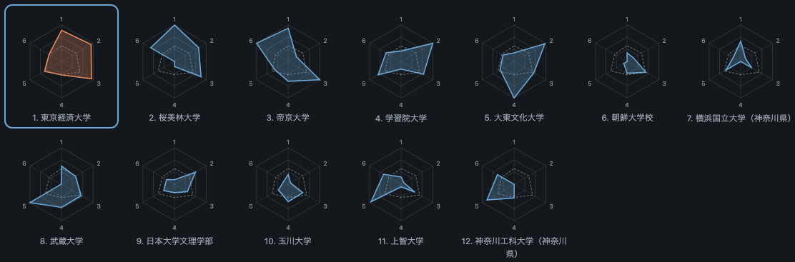

# Team profiles — 2026年度 第４回 関東大学サッカーリーグ戦 東京・神奈川 2部

*[日本語](2026-d2.ja.md)*

Every club in the division, from the federation's published match records. Aggregates only — no individual appears in this document; see [../DATA_POLICY.en.md](../DATA_POLICY.en.md).

Snapshot of 2026 2部リーグ, generated 2026-09-28. Regenerate with `togakuren profiles --series "2026 2部リーグ" --lang en`.

**Season in progress: 80 of 90 fixtures played.**

## League table

| # | Team | P | Pts | W-D-L | GF | GA | GD | Shots | S/game | Conv |
| --- | --- | --: | --: | --: | --: | --: | --: | --: | --: | --: |
| 1 | 東京大学 | 16 | 42 | 13-3-0 | 30 | 10 | 20 | 155 | 9.7 | 0.194 |
| 2 | 日本文化大學 | 16 | 38 | 12-2-2 | 36 | 10 | 26 | 228 | 14.2 | 0.158 |
| 3 | 成蹊大学 | 16 | 36 | 11-3-2 | 30 | 12 | 18 | 225 | 14.1 | 0.133 |
| 4 | 成城大学 | 16 | 24 | 7-3-6 | 30 | 23 | 7 | 166 | 10.4 | 0.181 |
| 5 | 東京理科大学 | 16 | 19 | 5-4-7 | 24 | 24 | 0 | 171 | 10.7 | 0.140 |
| 6 | 芝浦工業大学 | 16 | 16 | 5-1-10 | 26 | 30 | -4 | 180 | 11.2 | 0.144 |
| 7 | 東京都立大学 | 16 | 14 | 4-2-10 | 16 | 22 | -6 | 140 | 8.8 | 0.114 |
| 8 | 創価大学 | 16 | 14 | 3-5-8 | 13 | 30 | -17 | 144 | 9.0 | 0.090 |
| 9 | 防衛大学校（神奈川県） | 16 | 13 | 4-1-11 | 16 | 44 | -28 | 105 | 6.6 | 0.152 |
| 10 | 一橋大学 | 16 | 11 | 3-2-11 | 13 | 29 | -16 | 117 | 7.3 | 0.111 |

## Fingerprints

Six indices, each scaled within this division. The vertices are numbered 1-6 clockwise from the top, in the order the indices are listed under each club below, and the dashed outline is the division mean. The chart is the same one the dashboard draws; the numbers under each club repeat it in text.

### 1. 東京大学

16 played · 42 points · 30 scored, 10 conceded · 9.7 shots per game at 0.194 · 26 players used, top eleven took 83% of the minutes · mean year 3.18

**Indices** — Shot volume 41 / Finishing 100 / Defence 100 / Rotation 4 / Underclassmen 16 / Second-half weight 57

10 against the top half, 20 against the bottom half (67% from below).

**By academic year**

| Year | Players | Minutes | Goals |
| --- | --: | --: | --: |
| 1 | 0 | 0 | 0 |
| 2 | 6 | 3267 | 11 |
| 3 | 9 | 6424 | 3 |
| 4 | 11 | 6149 | 16 |

**Season history**

| Season | Division | P | W-D-L | Pts | Pts/game | GF | GD |
| --- | --- | --: | --: | --: | --: | --: | --: |
| 2021 | 1部リーグ | 24 | 2-3-19 | 9 | 0.38 | 11 | -45 |
| 2022 | 2部リーグ | 20 | 13-4-3 | 43 | 2.15 | 43 | 29 |
| 2023 | 1部リーグ | 22 | 8-8-6 | 32 | 1.45 | 26 | 5 |
| 2024 | 1部リーグ | 22 | 5-4-13 | 19 | 0.86 | 32 | -9 |
| 2025 | 1部リーグ | 22 | 1-5-16 | 8 | 0.36 | 14 | -32 |
| 2026 | 2部リーグ | 16 | 13-3-0 | 42 | 2.62 | 30 | 20 |

### 2. 日本文化大學

16 played · 38 points · 36 scored, 10 conceded · 14.2 shots per game at 0.158 · 30 players used, top eleven took 84% of the minutes · mean year 1.79

**Indices** — Shot volume 100 / Finishing 66 / Defence 100 / Rotation 0 / Underclassmen 100 / Second-half weight 22

12 against the top half, 24 against the bottom half (67% from below).

**By academic year**

| Year | Players | Minutes | Goals |
| --- | --: | --: | --: |
| 1 | 12 | 5974 | 7 |
| 2 | 15 | 7143 | 17 |
| 3 | 3 | 2723 | 12 |
| 4 | 0 | 0 | 0 |

**Season history**

| Season | Division | P | W-D-L | Pts | Pts/game | GF | GD |
| --- | --- | --: | --: | --: | --: | --: | --: |
| 2021 | 4部リーグ | 5 | 5-0-0 | 15 | 3.0 | 18 | 13 |
| 2022 | チャレンジリーグ | 15 | 7-1-7 | 22 | 1.47 | 41 | 3 |
| 2023 | チャレンジリーグ | 13 | 7-2-4 | 23 | 1.77 | 47 | 16 |
| 2024 | 2部リーグ | 18 | 4-4-10 | 16 | 0.89 | 28 | -14 |
| 2025 | 3部リーグ | 16 | 14-0-2 | 42 | 2.62 | 61 | 50 |
| 2026 | 2部リーグ | 16 | 12-2-2 | 38 | 2.38 | 36 | 26 |

### 3. 成蹊大学

16 played · 36 points · 30 scored, 12 conceded · 14.1 shots per game at 0.133 · 35 players used, top eleven took 64% of the minutes · mean year 3.23

**Indices** — Shot volume 98 / Finishing 42 / Defence 94 / Rotation 100 / Underclassmen 14 / Second-half weight 100

7 against the top half, 23 against the bottom half (77% from below).

**By academic year**

| Year | Players | Minutes | Goals |
| --- | --: | --: | --: |
| 1 | 3 | 421 | 0 |
| 2 | 10 | 2602 | 7 |
| 3 | 10 | 5737 | 11 |
| 4 | 12 | 7080 | 10 |

**Season history**

| Season | Division | P | W-D-L | Pts | Pts/game | GF | GD |
| --- | --- | --: | --: | --: | --: | --: | --: |
| 2021 | 1部リーグ | 24 | 8-6-10 | 30 | 1.25 | 28 | -8 |
| 2022 | 1部リーグ | 22 | 9-3-10 | 30 | 1.36 | 24 | -2 |
| 2023 | 1部リーグ | 22 | 12-3-7 | 39 | 1.77 | 35 | 13 |
| 2024 | 1部リーグ | 22 | 9-5-8 | 32 | 1.45 | 29 | 2 |
| 2025 | 1部リーグ | 22 | 4-5-13 | 17 | 0.77 | 21 | -12 |
| 2026 | 2部リーグ | 16 | 11-3-2 | 36 | 2.25 | 30 | 18 |

### 4. 成城大学

16 played · 24 points · 30 scored, 23 conceded · 10.4 shots per game at 0.181 · 33 players used, top eleven took 68% of the minutes · mean year 2.78

**Indices** — Shot volume 50 / Finishing 88 / Defence 62 / Rotation 77 / Underclassmen 30 / Second-half weight 82

8 against the top half, 22 against the bottom half (73% from below).

**By academic year**

| Year | Players | Minutes | Goals |
| --- | --: | --: | --: |
| 1 | 10 | 3104 | 3 |
| 2 | 4 | 1769 | 2 |
| 3 | 10 | 6467 | 13 |
| 4 | 9 | 4500 | 10 |

**Season history**

| Season | Division | P | W-D-L | Pts | Pts/game | GF | GD |
| --- | --- | --: | --: | --: | --: | --: | --: |
| 2021 | 2部リーグ | 18 | 1-3-14 | 6 | 0.33 | 16 | -23 |
| 2022 | 2部リーグ | 20 | 12-1-7 | 37 | 1.85 | 60 | 22 |
| 2023 | 1部リーグ | 22 | 4-6-12 | 18 | 0.82 | 28 | -20 |
| 2024 | 2部リーグ | 17 | 10-2-5 | 32 | 1.88 | 46 | 20 |
| 2025 | 2部リーグ | 18 | 10-2-6 | 32 | 1.78 | 43 | 18 |
| 2026 | 2部リーグ | 16 | 7-3-6 | 24 | 1.5 | 30 | 7 |

### 5. 東京理科大学

16 played · 19 points · 24 scored, 24 conceded · 10.7 shots per game at 0.140 · 22 players used, top eleven took 79% of the minutes · mean year 3.36

**Indices** — Shot volume 54 / Finishing 48 / Defence 59 / Rotation 25 / Underclassmen 0 / Second-half weight 0

3 against the top half, 21 against the bottom half (88% from below).

**By academic year**

| Year | Players | Minutes | Goals |
| --- | --: | --: | --: |
| 1 | 0 | 0 | 0 |
| 2 | 5 | 1349 | 0 |
| 3 | 7 | 7406 | 3 |
| 4 | 10 | 7085 | 21 |

**Season history**

| Season | Division | P | W-D-L | Pts | Pts/game | GF | GD |
| --- | --- | --: | --: | --: | --: | --: | --: |
| 2021 | 2部リーグ | 18 | 7-6-5 | 27 | 1.5 | 27 | -1 |
| 2022 | 2部リーグ | 20 | 11-1-8 | 34 | 1.7 | 29 | 0 |
| 2023 | 1部リーグ | 22 | 1-3-18 | 6 | 0.27 | 13 | -50 |
| 2024 | 2部リーグ | 18 | 14-3-1 | 45 | 2.5 | 45 | 30 |
| 2025 | 1部リーグ | 22 | 2-3-17 | 9 | 0.41 | 18 | -41 |
| 2026 | 2部リーグ | 16 | 5-4-7 | 19 | 1.19 | 24 | 0 |

### 6. 芝浦工業大学

16 played · 16 points · 26 scored, 30 conceded · 11.2 shots per game at 0.144 · 26 players used, top eleven took 67% of the minutes · mean year 3.08

**Indices** — Shot volume 61 / Finishing 52 / Defence 41 / Rotation 84 / Underclassmen 29 / Second-half weight 0

12 against the top half, 14 against the bottom half (54% from below).

**By academic year**

| Year | Players | Minutes | Goals |
| --- | --: | --: | --: |
| 1 | 4 | 1692 | 1 |
| 2 | 6 | 3089 | 6 |
| 3 | 5 | 2704 | 4 |
| 4 | 10 | 8186 | 15 |

**Season history**

| Season | Division | P | W-D-L | Pts | Pts/game | GF | GD |
| --- | --- | --: | --: | --: | --: | --: | --: |
| 2022 | チャレンジリーグ | 15 | 12-1-2 | 37 | 2.47 | 85 | 67 |
| 2023 | 2部リーグ | 22 | 9-1-12 | 28 | 1.27 | 47 | 3 |
| 2024 | 2部リーグ | 18 | 10-1-7 | 31 | 1.72 | 29 | 2 |
| 2025 | 2部リーグ | 18 | 7-4-7 | 25 | 1.39 | 27 | 0 |
| 2026 | 2部リーグ | 16 | 5-1-10 | 16 | 1.0 | 26 | -4 |

### 7. 東京都立大学

16 played · 14 points · 16 scored, 22 conceded · 8.8 shots per game at 0.114 · 30 players used, top eleven took 70% of the minutes · mean year 2.53

**Indices** — Shot volume 28 / Finishing 23 / Defence 65 / Rotation 69 / Underclassmen 65 / Second-half weight 43

8 against the top half, 8 against the bottom half (50% from below).

**By academic year**

| Year | Players | Minutes | Goals |
| --- | --: | --: | --: |
| 1 | 5 | 1950 | 2 |
| 2 | 10 | 7027 | 10 |
| 3 | 7 | 3443 | 0 |
| 4 | 8 | 3420 | 4 |

**Season history**

| Season | Division | P | W-D-L | Pts | Pts/game | GF | GD |
| --- | --- | --: | --: | --: | --: | --: | --: |
| 2021 | 2部リーグ | 18 | 9-1-8 | 28 | 1.56 | 35 | 11 |
| 2022 | 2部リーグ | 20 | 9-5-6 | 32 | 1.6 | 44 | 18 |
| 2023 | 2部リーグ | 22 | 14-1-7 | 43 | 1.95 | 51 | 17 |
| 2024 | 2部リーグ | 18 | 5-6-7 | 21 | 1.17 | 25 | -6 |
| 2025 | 2部リーグ | 18 | 8-1-9 | 25 | 1.39 | 22 | -6 |
| 2026 | 2部リーグ | 16 | 4-2-10 | 14 | 0.88 | 16 | -6 |

### 8. 創価大学

16 played · 14 points · 13 scored, 30 conceded · 9.0 shots per game at 0.090 · 23 players used, top eleven took 71% of the minutes · mean year 2.32

**Indices** — Shot volume 32 / Finishing 0 / Defence 41 / Rotation 61 / Underclassmen 52 / Second-half weight 52

9 against the top half, 4 against the bottom half (31% from below).

**By academic year**

| Year | Players | Minutes | Goals |
| --- | --: | --: | --: |
| 1 | 7 | 3741 | 2 |
| 2 | 6 | 3639 | 2 |
| 3 | 4 | 3802 | 5 |
| 4 | 5 | 3513 | 1 |

**Season history**

| Season | Division | P | W-D-L | Pts | Pts/game | GF | GD |
| --- | --- | --: | --: | --: | --: | --: | --: |
| 2021 | 2部リーグ | 18 | 4-8-6 | 20 | 1.11 | 23 | -7 |
| 2022 | チャレンジリーグ | 15 | 11-1-3 | 34 | 2.27 | 52 | 33 |
| 2023 | チャレンジリーグ | 13 | 10-2-1 | 32 | 2.46 | 52 | 42 |
| 2024 | 2部リーグ | 18 | 10-2-6 | 32 | 1.78 | 36 | 15 |
| 2025 | 2部リーグ | 18 | 8-4-6 | 28 | 1.56 | 25 | 2 |
| 2026 | 2部リーグ | 16 | 3-5-8 | 14 | 0.88 | 13 | -17 |

### 9. 防衛大学校（神奈川県）

16 played · 13 points · 16 scored, 44 conceded · 6.6 shots per game at 0.152 · 26 players used, top eleven took 76% of the minutes · mean year 2.73

**Indices** — Shot volume 0 / Finishing 60 / Defence 0 / Rotation 36 / Underclassmen 28 / Second-half weight 43

7 against the top half, 9 against the bottom half (56% from below).

**By academic year**

| Year | Players | Minutes | Goals |
| --- | --: | --: | --: |
| 1 | 3 | 1340 | 0 |
| 2 | 4 | 3317 | 0 |
| 3 | 12 | 9385 | 15 |
| 4 | 7 | 1798 | 1 |

**Season history**

| Season | Division | P | W-D-L | Pts | Pts/game | GF | GD |
| --- | --- | --: | --: | --: | --: | --: | --: |
| 2023 | 2部リーグ | 22 | 5-3-14 | 18 | 0.82 | 27 | -34 |
| 2024 | 2部リーグ | 18 | 6-3-9 | 21 | 1.17 | 20 | -12 |
| 2025 | 3部リーグ | 16 | 11-1-4 | 34 | 2.12 | 32 | 22 |
| 2026 | 2部リーグ | 16 | 4-1-11 | 13 | 0.81 | 16 | -28 |

### 10. 一橋大学

16 played · 11 points · 13 scored, 29 conceded · 7.3 shots per game at 0.111 · 34 players used, top eleven took 74% of the minutes · mean year 3.18

**Indices** — Shot volume 10 / Finishing 20 / Defence 44 / Rotation 46 / Underclassmen 20 / Second-half weight 82

3 against the top half, 10 against the bottom half (77% from below).

**By academic year**

| Year | Players | Minutes | Goals |
| --- | --: | --: | --: |
| 1 | 5 | 747 | 1 |
| 2 | 8 | 2957 | 1 |
| 3 | 7 | 4785 | 2 |
| 4 | 14 | 7355 | 9 |

**Season history**

| Season | Division | P | W-D-L | Pts | Pts/game | GF | GD |
| --- | --- | --: | --: | --: | --: | --: | --: |
| 2021 | 2部リーグ | 18 | 9-4-5 | 31 | 1.72 | 28 | 9 |
| 2022 | 2部リーグ | 20 | 9-3-8 | 30 | 1.5 | 34 | 8 |
| 2023 | 2部リーグ | 22 | 17-1-4 | 52 | 2.36 | 67 | 45 |
| 2024 | 1部リーグ | 22 | 2-3-17 | 9 | 0.41 | 20 | -58 |
| 2025 | 2部リーグ | 18 | 7-4-7 | 25 | 1.39 | 26 | -2 |
| 2026 | 2部リーグ | 16 | 3-2-11 | 11 | 0.69 | 13 | -16 |

---

*Followed by federation club id, so a division change is a real move.*
